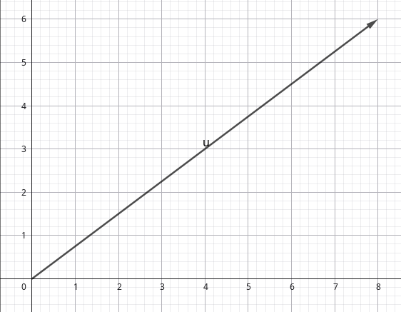
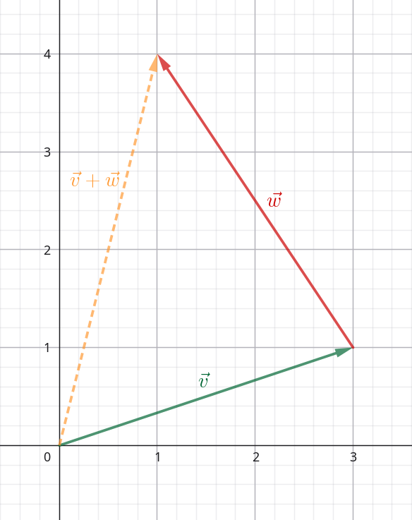
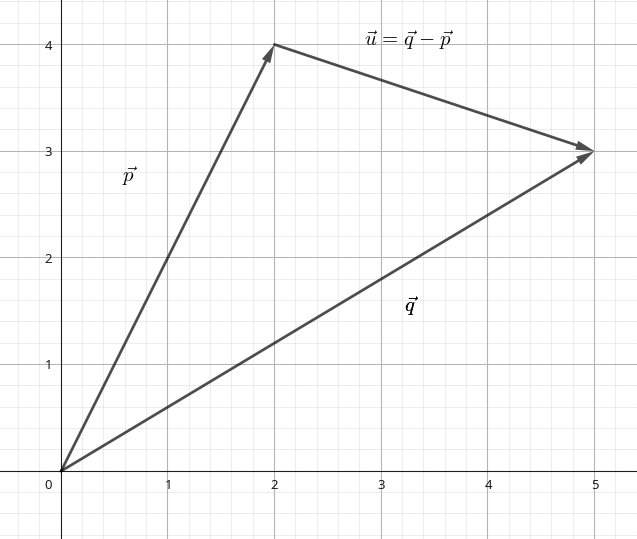
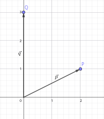

# Vectors

Source: [Khan Academy — Vectors and spaces](https://www.khanacademy.org/math/linear-algebra)

Vectors are used to represent many things around us: from forces like gravity, acceleration, friction, stress and strain on structures, to computer graphics used in almost all modern-day movies and video games. Vectors are an important concept, not just in math, but in physics, engineering, and computer graphics, so you're likely to see them again in other subjects.

Geometrically, a vector can be represented by a directed line segment, or arrow, whose direction indicates the vector’s direction and whose length represents its magnitude. Vectors are used, for example, to describe the velocity of a moving object.

The zero vector has magnitude zero and no defined direction. Vectors may also belong to a one-dimensional vector space.

## Example

Suppose an object is moving at a speed of $10\,\mathrm{m/s}$. If we also specify that it is moving generally towards north-east, we know both its speed and direction. Together, these define the object’s velocity. In physics, velocity is defined as the rate of change of position with respect to time.

Translate this into a vector, and we get:

- the vector's magnitude (or length) is $10\,\mathrm{m/s}$
- its direction is north-east

[@fig:vectors-example] shows a vector drawn in standard form, which means from the origin (0, 0).

{#fig:vectors-example width=70mm}

For a vector $\vec{v}=(a, b)$, the magnitude is calculated using the Pythagorean theorem:

$$
\lVert\vec v\rVert=\sqrt{a^2+b^2}
$$

In the example given, we have the velocity vector

$$
\vec{v}
=
\begin{bmatrix}
8 \\
6
\end{bmatrix}
\,\mathrm{m/s}
$$

that gives us the magnitude

$$
\lVert\vec v\rVert = \sqrt(8^2+6^2) = \sqrt(64+36) = \sqrt(100) = 10\,\mathrm{m/s}
$$

A vector's magnitude is denoted $\lVert\vec v \rVert$.

## Notation

Vectors can be written in several ways:

$$
\begin{aligned}
\vec{v}
&= (1, 2, 3) \\
&= \begin{bmatrix}1\\2\\3\end{bmatrix} \\
&= \blueD{\hat{\imath}}+2\maroonD{\hat{\jmath}}+3\greenD{\hat{k}}
\end{aligned}
$$

A vector is often denoted by placing a small arrow above its name, as in $\vec v$.

Depending on the context, $(1,2,3)$ can represent either a point or a vector. When it represents a position vector, the vector is drawn from the origin to the corresponding point. A free vector, however, may be translated without changing the vector.

The second representation is called column-vector notation. In $n$ dimensions, a general column vector has the form

$$
\begin{bmatrix}
v_1 \\
v_2 \\
\vdots \\
v_n
\end{bmatrix}
$$

This notation will be discussed in the coming articles.

The third notation expresses a vector as a linear combination of standard basis vectors. Each standard basis vector has magnitude one.

In two dimensions, the standard basis vectors are
$\blueD{\hat{\imath}}=(1,0)$ and
$\maroonD{\hat{\jmath}}=(0,1)$.
They are pronounced “i-hat” and “j-hat”.

In three dimensions, the standard basis vectors are
$\blueD{\hat{\imath}}=(1,0,0)$,
$\maroonD{\hat{\jmath}}=(0,1,0)$, and
$\greenD{\hat{k}}=(0,0,1)$.

In $\mathbb{R}^n$, the standard basis vectors are usually denoted
$\mathbf e_1,\ldots,\mathbf e_n$.

This notation might make more sense once we cover vector addition.

Coordinate vectors can have any finite number of components. The space $\mathbb R^n$ has dimension $n$.

### Real coordinate spaces

When working with vectors, you will often encounter notation such as $\mathbb{R}^2$ and $\mathbb{R}^3$. The symbol $\mathbb{R}$ denotes the set of real numbers, while the exponent specifies the number of coordinates.

For example,

$$
\mathbb{R}^2
=
\{(x_1,x_2) \mid x_1,x_2 \in \mathbb{R}\}
$$

is the set of all ordered pairs of real numbers. Similarly,

$$
\mathbb{R}^3
=
\{(x_1,x_2,x_3) \mid x_1,x_2,x_3 \in \mathbb{R}\}
$$

is the set of all ordered triples of real numbers. More generally, $\mathbb{R}^n$ is the set of all ordered $n$-tuples of real numbers.

An element of $\mathbb{R}^n$ is a vector and can be written as either a tuple or a column vector:

$$
\vec{v}
=
(v_1,v_2,\ldots,v_n)
=
\begin{bmatrix}
v_1 \\
v_2 \\
\vdots \\
v_n
\end{bmatrix}
$$

The space $\mathbb{R}^2$ is not itself a vector; it is a vector space
of dimension two. A vector $\vec{v}\in\mathbb{R}^2$ has two components
and can be represented in the coordinate plane. Likewise, a vector
$\vec{v}\in\mathbb{R}^3$ has three components and can be represented
in three-dimensional space.

Depending on the context, the same tuple can describe either a point
or the position vector from the origin to that point.

## Addition

Vectors can be added and subtracted provided that they belong to the same vector space. In $\mathbb R^n$, this means that they must have the same number of components. We add two vectors by adding their corresponding components. Say we have:

$$
\begin{aligned}
\vec{v} &= (v_1, v_2, \dots, v_n) \\
\vec{w} &= (w_1, w_2, \dots, w_n)
\end{aligned}
$$

then their sum is:

$$
\vec{v}+\vec{w}
= (v_1+w_1, v_2+w_2, \dots, v_n+w_n)
$$

The result of the addition (or subtraction) is another vector in $\mathbb{R}^n$.

Geometrically, $\greenD{\vec{v}}+\redD{\vec{w}}$ can be visualized by translating $\redD{\vec{w}}$ so that its tail lies at the tip of $\greenD{\vec{v}}$. The resulting vector spans from the tail of $\greenD{\vec{v}}$ to the tip of the translated $\redD{\vec{w}}$. The following example illustrates this.

Suppose we have two vectors:

$$
\begin{aligned}
\greenD{\vec{v}} &\greenD{= \begin{bmatrix} 3 \\ 1 \end{bmatrix}} \\
\redD{\vec{w}} &\redD{= \begin{bmatrix} -2 \\ 3 \end{bmatrix}}
\end{aligned}
$$

Then we get:

$$
\greenD{\vec{v}}+\redD{\vec{w}}
=
\left[
\begin{aligned}
\greenD{3} &{}+\redD{(-2)} \\
\greenD{1} &{}+\redD{3}
\end{aligned}
\right]
=
\begin{bmatrix}
\goldD{1} \\
\goldD{4}
\end{bmatrix}
$$

The resulting vector is shown in orange in [@fig:vector-add-example]

{#fig:vector-add-example width=70mm}

\newpage

## Scalar multiplication

A scalar is simply a number. Scalar multiplication means multiplying each component of a vector by the scalar. If $c\in\mathbb R$ and $\vec{v}=(v_1,\ldots,v_n)$, then

$$
c\vec v=(cv_1,\ldots,cv_n).
$$

The resulting vector is collinear with the original vector, and its magnitude is
$$
\lVert c\vec v\rVert=|c|\lVert\vec v\rVert.
$$

If $c>0$, the direction remains the same; if $c<0$, the direction is reversed. If $c=0$, the result is the zero vector.

## Parametric representation of lines

During Algebra I, we learnt that non-vertical lines could be represented by:

$$
y=mx+b
$$

where $m$ is the slope and $b$ is the $y$-intercept. This form cannot represent vertical lines and does not generalise conveniently to higher-dimensional spaces. Parametric representations overcome both limitations.

Suppose we have the two position vectors, $\vec{p} = $ and $\vec{q}$, representing distinct points. The vector

$$
\vec{q}-\vec{p}
$$

gives a direction from $\vec{p}$ to $\vec{q}$, as seen in [@fig:vectors-subtract-example].

{#fig:vectors-subtract-example width=70mm}

That naturally leads to:

$$
\vec{r(t)} = \vec{p}+t(\vec{q}-\vec{p}), \qquad t \in\mathbb{R}
$$

Suppose we have two position vectors:

$$
\vec{v} = \begin{bmatrix} 2 \\ 1 \end{bmatrix},
\vec{w} = \begin{bmatrix} 0 \\ 3 \end{bmatrix}
$$

Drawn on standard form they look like in [@fig:vectors-projection-002].

Here we have some random text

{#fig:vectors-projection-002 width=70mm}

This is just some random text.

\newpage