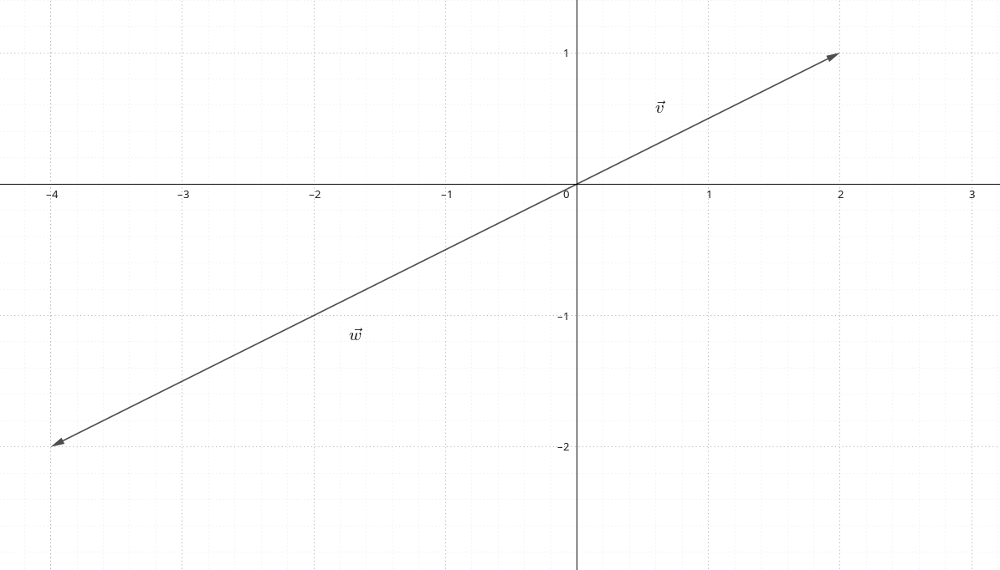
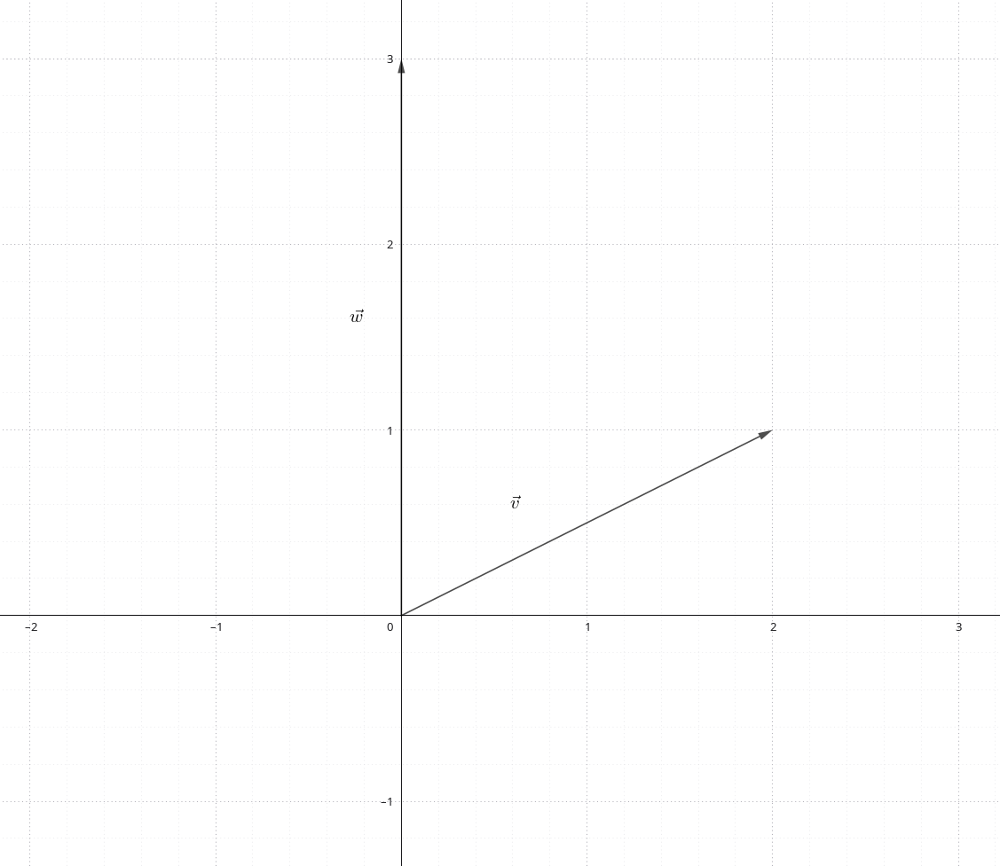

# Linear Combinations and Span

Source: [Khan Academy — Linear Combinations and Span](https://www.khanacademy.org/math/linear-algebra)

A linear combination of $v_1,\dotsc,v_n$ is any vector of the form

$$
c_1v_1+c_2v_2+\cdots+c_nv_n,
\qquad c_1,\dotsc,c_n\in\mathbb{R}.
$$

## Span

The span of a set of vectors is the set of all their linear combinations. Two non-parallel vectors in $\mathbb{R}^2$ span all of $\mathbb{R}^2$.

$$
\operatorname{span}(v_1, \dotsc,  v_n)
=
\left\{
c_1v_1+c_2v_2+\cdots+c_nv_n
\;\middle|\;
c_i\in\mathbb{R} \text{ for }1\le i\le n
\right\}
$$

## Examples with collinear vectors

As [@fig:vector-linear-combinations-and-span-001] shows, the collinear vectors $\vec{v}$ and $\vec{w}$ lie on the same line through the origin.

{#fig:vector-linear-combinations-and-span-001 width=120mm}

\newpage

## Examples with non-parallel vectors

In comparison, referring to [@fig:vector-linear-combinations-and-span-002], we see that with the vectors

$$
\vec{v}
=
\begin{bmatrix}
2 \\ 1
\end{bmatrix}
,
\vec{w}
=
\begin{bmatrix}
0 \\ 3
\end{bmatrix}
$$

we are able to span all of $\mathbb{R}^2$.

{#fig:vector-linear-combinations-and-span-002 width=120mm}

Suppose we want to express the vector

$$
\vec{u}
=
\begin{bmatrix}
1 \\ 3
\end{bmatrix}
$$

as a linear combination of $\vec{v}$ and $\vec{w}$.

In general form, we could set it up like:

$$
c_1
\begin{bmatrix}
2\\1
\end{bmatrix}
+
c_2
\begin{bmatrix}
0\\3
\end{bmatrix}
=
\begin{bmatrix}
x_1\\x_2
\end{bmatrix}
$$ {#eq:span-general}

\newpage

This creates a system of two unknowns:

```{=latex}
\begin{align}
2c_1 + 0c_2 &= x_1
    \label{eq:span-x1} \\
c_1 + 3c_2 &= x_2
    \label{eq:span-x2}
\end{align}
```

Solving this system gives:

```{=latex}
\begin{align}
c_1 &= \frac{1}{2}\cdot x_1
    \label{eq:span-c1} \\
c_2 &= \frac{1}{3}\left(x_2-\frac{x_1}{2}\right)
    \label{eq:span-c2}
\end{align}
```

Substituting $x_1=1$ and $x_2=3$ into [@eq:span-c1] and [@eq:span-c2], we obtain:

$$
\frac{1}{2}
\cdot
\begin{bmatrix}
2\\1
\end{bmatrix}
+
\frac{5}{6}
\cdot
\begin{bmatrix}
0\\3
\end{bmatrix}
=
\begin{bmatrix}
1\\3
\end{bmatrix}
$$

Therefore, $\vec{u}\in\operatorname{span}(\vec{v},\vec{w})$.

\newpage

- General vector equation: [@eq:span-general]
- Component equations: [@eq:span-x1] and [@eq:span-x2]
- Scalar coefficients: [@eq:span-c1] and [@eq:span-c2]

\newpage
