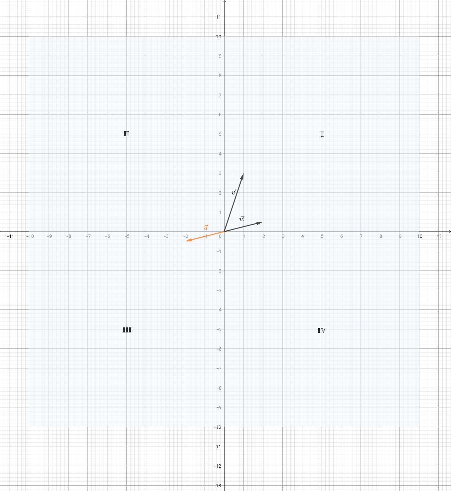

# Linear Subspaces

Source: [Khan Academy — Subspaces and the Basis for a Subspace](https://www.khanacademy.org/math/linear-algebra)

We now possess the tools to understand the idea of a linear subspace in $\mathbb{R}^n$.

Suppose $V\subseteq\mathbb{R}^n$ (meaning: $V$ is a subset of $\mathbb{R}^n$). For $V$ to be a *subspace* of $\mathbb{R}^n$, three conditions must be satisfied:

- The zero vector belongs to $V$
- If $\vec{x}\in V$ and $c \in \mathbb{R}$, then $c\vec{x}\in V$ (closure under scalar multiplication)
- If $\vec{a}, \vec{b}\in V$, then $\vec{a}+\vec{b}\in V$ (closure under addition)
 
## Example 1

Suppose we have $V=\left\{\vec{0}\right\}, \vec{0}=\begin{bmatrix}0\\0\\0\end{bmatrix}$. Is $V$ a subspace of $\mathbb{R}^3$? Let's see if it satisfies the three conditions for a subspace:

- the only vector in $V$ is $\vec{0}$, so this condition is satisfied
- $c\vec{0}=\vec{0}, c\in\mathbb{R}$, we have closure under scalar multiplication
- $\vec{0}+\vec{0}=\vec{0}$, we have closure under addition

All three conditions are met, so clearly $V$ is a subspace of $\mathbb{R}^3$.

## Example 2

Say we have the set $S$ which is the set of all vectors in $\mathbb{R}^2$ such that $x_1$ is greater than or equal to $0$:

$$
S=\left\{
\begin{bmatrix}
x_1\\
x_2
\end{bmatrix}
\in\mathbb{R}^2
\;\middle|\;
x_1\ge 0
\right\}.
$$

Is this set a subspace of $\mathbb{R}^2$?

Looking at [@fig:vectors-subspace-example-quadrants], if we multiply a vector in $S$ with $x_1>0$ by a negative scalar, its first component becomes negative, so the resulting vector is not in $S$.

Therefore $S$ is not a subspace of $\mathbb{R}^2$.

{#fig:vectors-subspace-example-quadrants width=120mm}

\newpage

## Example 3

One more example just to kind of drive the point home.

Let's say I want to know the span of some vectors, is that a valid subspace?

$$
\text{Let }
\vec v_1,\vec v_2,\vec v_3\in\mathbb R^n,
\qquad
U=\operatorname{span}(\vec v_1,\vec v_2,\vec v_3)
$$

Is $U$ a valid subspace of $\mathbb{R}^n$?

1. First, does it contain the $\vec{0}$?
   If we multiply with $0$, we get:

   $$
   0\vec{v_1} + 0\vec{v_2} + 0\vec{v_3} = \vec{0}
   $$

   So yes, it contains the zero vector.

2. Do we have closure under scalar multiplication?
   Let's pick a random vector from within the set, say $\vec{x}$. Now, in order to be part of the set, $\vec{x}$ must be a linear combination of $\vec{v_1}, \vec{v_2}, \vec{v_3}$:

   $$
   \vec{x}=c_1\vec{v_1} + c_2\vec{v_2} + c_3\vec{v_3}
   $$

   If we now multiply with another arbitrary constant on both sides of the equation, we get:

   $$
   a\vec{x}=ac_1\vec{v_1} + ac_2\vec{v_2} + ac_3\vec{v_3}
   ,\qquad
   a\in\mathbb{R}
   $$

   This clearly gives us a vector within the span, therefore we have closure under scalar multiplication.

3. Do we have closure under addition?
   Let's define another vector that's within the span:

   $$
   \vec{y}
   =
   d_1\vec{v_1} + d_2\vec{v_2} + d_3\vec{v_3}
   $$

   Now, what is $\vec{x} + \vec{y}$?

   $$
   \vec{x}
   +
   \vec{y}
   =
   c_1\vec{v_1} + c_2\vec{v_2} + c_3\vec{v_3}
   +
   d_1\vec{v_1} + d_2\vec{v_2} + d_3\vec{v_3}
   $$

   which can be written as:

   $$
   \vec{x}
   +
   \vec{y}
   =
   (c_1+d_1)\vec{v_1}+(c_2+d_2)\vec{v_2}+(c_3+d_3)\vec{v_3}
   $$

   which also must be in the span.
   Therefore we also have closure under addition.

We can conclude that $U$ is a valid subspace of $\mathbb{R}^n$.

\newpage

# Basis of a Subspace

A basis is a linearly independent spanning set.

In order for a subspace to be a basis of $\mathbb{R}^n$

\newpage
