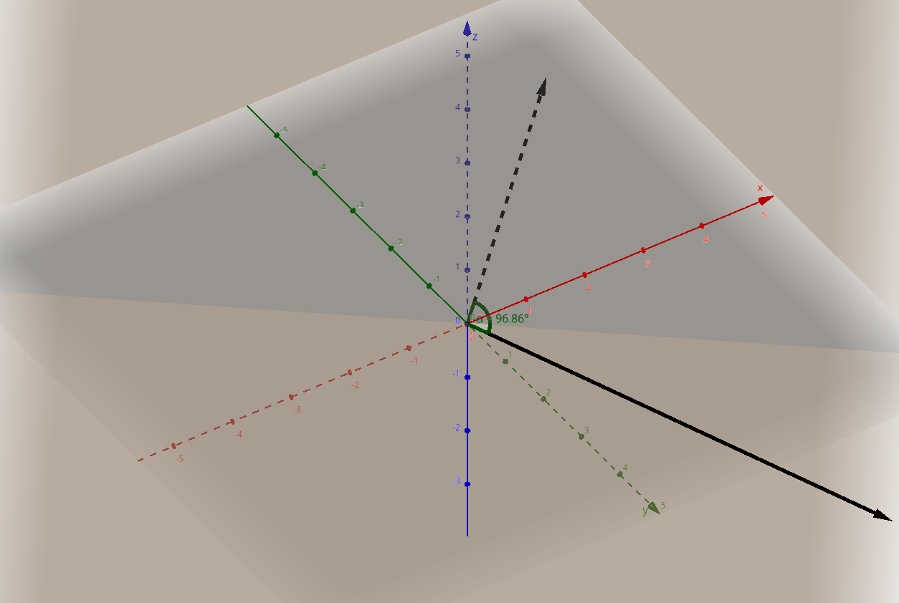

## Vector dot and cross products

Source: [Khan Academy — Vector dot and cross products](https://www.khanacademy.org/math/linear-algebra)

### Intuition

The geometric meanings of the dot product (@eq:dot-x1) and the magnitude of the cross product (@eq:cross-x1) are captured by:

```{=latex}
\begin{align}
\vec{a} \cdot \vec{b} &= \lVert\vec{a}\rVert \lVert\vec{b}\rVert \cos(\theta) \label{eq:dot-x1} \\
\lVert\vec{a} \times \vec{b}\rVert &= \lVert\vec{a}\rVert \lVert\vec{b}\rVert \sin(\theta) \label{eq:cross-x1}
\end{align}
```

The dot product, defined for $\mathbb{R}^n$, returns a signed scalar measuring how strongly two vectors point in the same direction, scaled by their lengths.

The standard cross product, defined for vectors in $\mathbb{R}^3$, returns a vector perpendicular to both input vectors. Its direction is determined by the right-hand rule. Its magnitude measures the area of the parallelogram spanned by the two input vectors.

### Dot product

The dot product, denoted $\vec{a}\cdot\vec{b}$ and pronounced “vector
$a$ dot vector $b$,” is a scalar obtained by multiplying corresponding
components of two vectors and adding the products.

For two vectors $\vec{a},\vec{b}\in\mathbb{R}^n$,

$$
\begin{aligned}
\vec{a}\cdot\vec{b}
&=
\begin{bmatrix}
a_1\\a_2\\\vdots\\a_n
\end{bmatrix}
\begin{bmatrix}
b_1\\b_2\\\vdots\\b_n
\end{bmatrix}\\
&=
a_1b_1+a_2b_2+\dotsb+a_nb_n
\end{aligned}
$$

The two vectors must have the same number of components. Unlike vector
addition, the result is a number rather than another vector.

#### Example

Let

$$
\vec{a}
=
\begin{bmatrix}
2\\-1\\3
\end{bmatrix},
\qquad
\vec{b}
=
\begin{bmatrix}
4\\5\\-2
\end{bmatrix}
$$

Their dot product is

$$
\vec{a}\cdot\vec{b}
=
2(4)+(-1)(5)+3(-2)
=
8-5-6
=
-3
$$

#### Geometric meaning

The dot product can also be expressed in terms of the magnitudes of the
vectors and the angle $\theta$ between them in the two-dimensional plane they describe (see @fig:vectors-in-r3-defining-a-plane):

$$
\vec{a}\cdot\vec{b}
=
\lVert\vec{a}\rVert
\lVert\vec{b}\rVert
\cos\theta,
\qquad
0\leq\theta\leq\pi
$$

{#fig:vectors-in-r3-defining-a-plane width=120mm}

If both vectors are nonzero, this equation allows us to find the angle
between them:

$$
\theta
=
\arccos
\left(
\frac{\vec{a}\cdot\vec{b}}
{\lVert\vec{a}\rVert\lVert\vec{b}\rVert}
\right)
$$

The sign of the dot product tells us whether the angle is acute, right,
or obtuse:

- $\vec{a}\cdot\vec{b}>0$ when $0\leq\theta<\frac{\pi}{2}$
- $\vec{a}\cdot\vec{b}=0$ when $\theta=\frac{\pi}{2}$
- $\vec{a}\cdot\vec{b}<0$ when $\frac{\pi}{2}<\theta\leq\pi$

When $\vec{a}\cdot\vec{b}=0$, the vectors are said to be *orthogonal*. The zero vector has a zero dot product with every vector, although it does not have a defined direction or form an angle with another vector.

##### Orthogonal versus perpendicular

Orthogonality is an algebraic concept: two vectors are orthogonal when their dot product is zero. This definition applies in any number of dimensions and does not depend on how the vectors are positioned geometrically. Perpendicularity is primarily a geometric concept, usually describing lines or other objects that meet at a right angle.

##### Example: testing for orthogonality

Consider

$$
\vec{u}
=
\begin{bmatrix}
1\\2\\-1
\end{bmatrix},
\qquad
\vec{v}
=
\begin{bmatrix}
3\\-1\\1
\end{bmatrix}
$$

Then

$$
\vec{u}\cdot\vec{v}
=
1(3)+2(-1)+(-1)(1)
=
3-2-1
=
0
$$

Therefore, $\vec{u}$ and $\vec{v}$ are orthogonal.

#### Dot product and magnitude

Taking the dot product of a vector with itself gives the square of its
magnitude:

$$
\vec{a}\cdot\vec{a}
=
a_1^2+a_2^2+\dotsb+a_n^2
=
\lVert\vec{a}\rVert^2
$$

Consequently,

$$
\lVert\vec{a}\rVert
=
\sqrt{\vec{a}\cdot\vec{a}}
$$

#### Properties

For $\vec{a},\vec{b},\vec{c}\in\mathbb{R}^n$ and
$k\in\mathbb{R}$, the dot product satisfies:

$$
\begin{aligned}
\vec{a}\cdot\vec{b}
&=\vec{b}\cdot\vec{a}
&&\text{(commutative)}\\
\vec{a}\cdot(\vec{b}+\vec{c})
&=\vec{a}\cdot\vec{b}+\vec{a}\cdot\vec{c}
&&\text{(distributive)}\\
(k\vec{a})\cdot\vec{b}
&=k(\vec{a}\cdot\vec{b})
&&\text{(compatible with scalar multiplication)}\\
\vec{a}\cdot\vec{a}
&\geq 0
&&\text{(nonnegative)}
\end{aligned}
$$

Furthermore, $\vec{a}\cdot\vec{a}=0$ if and only if $\vec{a}=\vec{0}$.

#### Cauchy-Schwarz inequality

The Cauchy–Schwarz inequality states that for any two vectors the absolute value of their dot product is less than or equal to the product of their magnitudes:

$$
|\vec{a}\cdot\vec{b}|
\le \lVert\vec{a}\rVert\lVert\vec{b}\rVert,
$$

with equality exactly when the vectors are linearly dependent. If both vectors are nonzero, it explains why

$$
\frac{\vec a\cdot\vec b}
{\lVert\vec a\rVert\lVert\vec b\rVert}
$$

must lie in $[-1,1]$, so the angle formula using $\arccos$ is valid. It also supports the projection material and gives a useful geometric interpretation: the absolute value of the dot product cannot exceed the product of the vectors’ lengths.

\newpage

#### Projections

The dot product can be used to find how much one vector points in the
direction of another.

We distinguish between the scalar component and the vector projection. Both are discussed below.

##### Signed scalar component

First there is the scalar component of $\vec{a}$ in the direction of a nonzero vector $\vec{b}$. This is obtained by dividing the dot product of $\vec{a}$ and $\vec{b}$ by the magnitude of $\vec{b}$.

$$
\operatorname{comp}_{\vec{b}}\vec{a}
=
\frac{\vec{a}\cdot\vec{b}}{\lVert\vec{b}\rVert}
$$

The result is a signed scalar measuring how far $\vec a$ extends in the direction of $\vec b$.

In my words, I'd put it like:

> How much vector a pulls in the direction of vector b.

The example in [@fig:scalar_component_a_rel_b] gives:

$$
\vec{a}
=
\begin{bmatrix}
3\\4
\end{bmatrix}
\qquad
\vec{b}
=
\begin{bmatrix}
4\\0
\end{bmatrix}
$$

Calculating the result, we get:

$$
\operatorname{comp}_{\vec{b}}\vec{a}
=
\frac{\vec{a}\cdot\vec{b}}{\lVert\vec{b}\rVert}
=
\frac{12}{4}
=
3
$$

In $\mathbb{R}^2$, this is visualized in [@fig:scalar_component_a_rel_b]. The red arrow points in the direction of $\vec{b}$, and its length $3$ represents the scalar component of $\vec{a}$ in that direction.

{#fig:scalar_component_a_rel_b width=90mm}

\newpage

##### Vector projection

The corresponding vector quantity is the vector projection.

Multiplying this signed length by the unit vector in the direction of
$\vec{b}$ gives the vector projection:

$$
\operatorname{proj}_{\vec{b}}\vec{a}
=
\frac{\vec{a}\cdot\vec{b}}
{\lVert\vec{b}\rVert^2}
\vec{b}
=
\frac{\vec{a}\cdot\vec{b}}
{\vec{b}\cdot\vec{b}}
\vec{b}
,\qquad
\vec{b} \ne \vec{0}
$$

For example, let

$$
\vec{a}
=
\begin{bmatrix}
1\\5
\end{bmatrix}
,\qquad
\vec{b}
=
\begin{bmatrix}
5\\-3
\end{bmatrix}
$$

The projection of $\vec{a}$ onto $\vec{b}$ is

$$
\operatorname{proj}_{\vec{b}}\vec{a}
=
\frac{
        \begin{bmatrix}
        1\\5
        \end{bmatrix}
        \cdot
        \begin{bmatrix}
        5\\-3
        \end{bmatrix}
     }
     {
        \begin{bmatrix}
        5\\-3
        \end{bmatrix}
        \cdot
        \begin{bmatrix}
        5\\-3
        \end{bmatrix}
     }
\begin{bmatrix}
5\\-3
\end{bmatrix}
=
\frac{-5}{17}
\begin{bmatrix}
5\\-3
\end{bmatrix}
=
\begin{bmatrix}
-\frac{25}{17}\\\frac{15}{17}
\end{bmatrix}
$$

The remaining component,

$$
\vec{a}-\operatorname{proj}_{\vec{b}}\vec{a}
=
\begin{bmatrix}
\frac{42}{17}\\\frac{70}{17}
\end{bmatrix}
$$

is orthogonal to $\vec{b}$.

Referring to [@fig:vector_projection_002_hand_drawn], $\vec{a}_1$ represents the projection of $\vec{a}$ onto $\vec{b}$.

{#fig:vector_projection_002_hand_drawn width=90mm}

\newpage

### Cross Product

The cross product of two vectors in $\mathbb{R}^3$, denoted
$\vec{a}\times\vec{b}$ and pronounced “vector $a$ cross vector $b$,”
is a vector perpendicular to both $\vec{a}$ and $\vec{b}$.

For

$$
\vec{a}
=
\begin{bmatrix}
a_1\\a_2\\a_3
\end{bmatrix},
\qquad
\vec{b}
=
\begin{bmatrix}
b_1\\b_2\\b_3
\end{bmatrix}
$$

the cross product is

$$
\vec{a}\times\vec{b}
=
\begin{bmatrix}
a_2b_3-a_3b_2\\
a_3b_1-a_1b_3\\
a_1b_2-a_2b_1
\end{bmatrix}
$$

It can be remembered using the formal determinant:

$$
\vec{a}\times\vec{b}
=
\begin{array}{ccc}
\redD{\cancel{\hat{\imath}}} & \redD{\cancel{\hat{\jmath}}} & \redD{\cancel{\hat{k}}} \\
\redD{\cancel{a_1}} & \greenD{a_2} & \greenD{a_3} \\
\redD{\cancel{b_1}} & \greenD{b_2} & \greenD{b_3}
\end{array}
-
\begin{array}{ccc}
\redD{\cancel{\hat{\imath}}} & \redD{\cancel{\hat{\jmath}}} & \redD{\cancel{\hat{k}}} \\
\greenD{a_1} & \redD{\cancel{a_2}} & \greenD{a_3} \\
\greenD{b_1} & \redD{\cancel{b_2}} & \greenD{b_3}
\end{array}
+
\begin{array}{ccc}
\redD{\cancel{\hat{\imath}}} & \redD{\cancel{\hat{\jmath}}} & \redD{\cancel{\hat{k}}} \\
\greenD{a_1} & \greenD{a_2} & \redD{\cancel{a_3}} \\
\greenD{b_1} & \greenD{b_2} & \redD{\cancel{b_3}}
\end{array}
$$

Cross-multiplying the four green entries in each block—downward product minus upward product—gives:

$$
\vec{a}\times\vec{b}
=
(a_2b_3 - b_2a_3)\hat{\imath}
-
(a_1b_3 - b_1a_3)\hat{\jmath}
+
(a_1b_2 - b_1a_2)\hat{k}
$$

The minus sign in the $\hat{\jmath}$ component is important.

#### Example

Let

$$
\vec{a}
=
\begin{bmatrix}
1\\2\\3
\end{bmatrix},
\qquad
\vec{b}
=
\begin{bmatrix}
4\\5\\6
\end{bmatrix}
$$

Then

$$
\begin{aligned}
\vec{a}\times\vec{b}
&=
\begin{bmatrix}
2(6)-3(5)\\
3(4)-1(6)\\
1(5)-2(4)
\end{bmatrix}\\
&=
\begin{bmatrix}
-3\\6\\-3
\end{bmatrix}
\end{aligned}
$$

We can confirm that the result is perpendicular to both original
vectors:

$$
\begin{aligned}
\vec{a}\cdot(\vec{a}\times\vec{b})
&=1(-3)+2(6)+3(-3)=0,\\
\vec{b}\cdot(\vec{a}\times\vec{b})
&=4(-3)+5(6)+6(-3)=0
\end{aligned}
$$

#### Magnitude and Direction

If $\theta$ is the angle between $\vec{a}$ and $\vec{b}$, then

$$
\lVert\vec{a}\times\vec{b}\rVert
=
\lVert\vec{a}\rVert
\lVert\vec{b}\rVert
\sin\theta
$$

The direction of $\vec{a}\times\vec{b}$ is determined by the
right-hand rule: point the fingers of the right hand along $\vec{a}$
and curl them toward $\vec{b}$. The thumb points in the direction of
$\vec{a}\times\vec{b}$.

Since reversing the order reverses the direction,

$$
\vec{b}\times\vec{a}
=
-(\vec{a}\times\vec{b})
$$

Therefore, the cross product is not commutative.

The standard basis vectors illustrate this orientation:

$$
\hat{\imath}\times\hat{\jmath}=\hat{k},
\qquad
\hat{\jmath}\times\hat{k}=\hat{\imath},
\qquad
\hat{k}\times\hat{\imath}=\hat{\jmath}
$$

Reversing any of these products changes its sign.

#### Area

The magnitude $\lVert\vec{a}\times\vec{b}\rVert$ equals the area of
the parallelogram spanned by $\vec{a}$ and $\vec{b}$. The area of the
triangle spanned by the same vectors is therefore

$$
A_{\triangle}
=
\frac{1}{2}
\lVert\vec{a}\times\vec{b}\rVert
$$

If the vectors are parallel, then $\theta=0$ or $\theta=\pi$, so
$\sin\theta=0$ and their cross product is the zero vector. Conversely,
for vectors in $\mathbb{R}^3$,

$$
\vec{a}\times\vec{b}=\vec{0}
$$

if and only if the vectors are parallel or at least one is the zero
vector.

#### Properties

For $\vec{a},\vec{b},\vec{c}\in\mathbb{R}^3$ and
$k\in\mathbb{R}$,

$$
\begin{aligned}
\vec{a}\times\vec{b}
&=-(\vec{b}\times\vec{a})
&&\text{(anticommutative)},\\
\vec{a}\times(\vec{b}+\vec{c})
&=\vec{a}\times\vec{b}+\vec{a}\times\vec{c}
&&\text{(distributive)},\\
(k\vec{a})\times\vec{b}
&=k(\vec{a}\times\vec{b})
&&\text{(compatible with scalar multiplication)},\\
\vec{a}\times\vec{a}
&=\vec{0}.
\end{aligned}
$$

In general, the cross product is not associative:

$$
(\vec{a}\times\vec{b})\times\vec{c}
\neq
\vec{a}\times(\vec{b}\times\vec{c})
$$

#### Dot Product Compared with Cross Product

The dot product applies to two vectors in $\mathbb{R}^n$ and produces
a scalar. It measures how strongly the vectors point in the same
direction.

The cross product, in this form, applies to two vectors in
$\mathbb{R}^3$ and produces a vector perpendicular to both. Its
magnitude measures the area spanned by the vectors, while its
direction records their orientation.

\newpage
