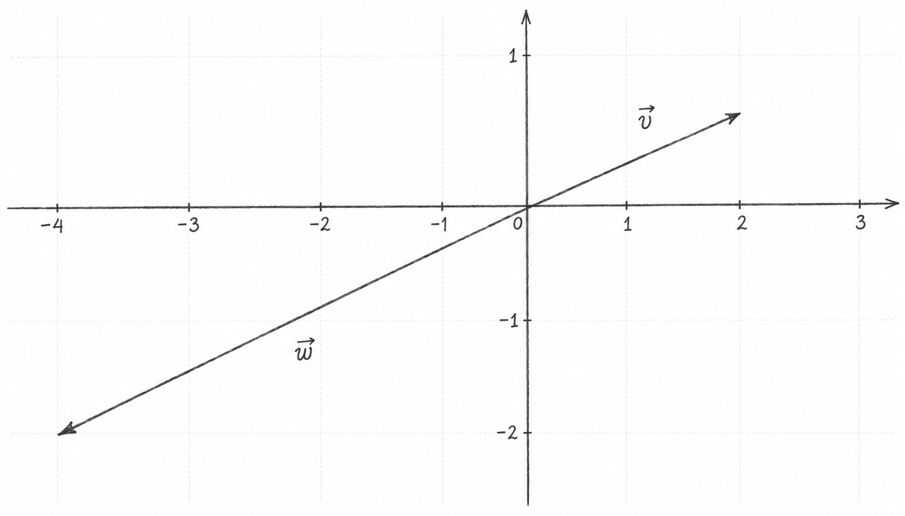
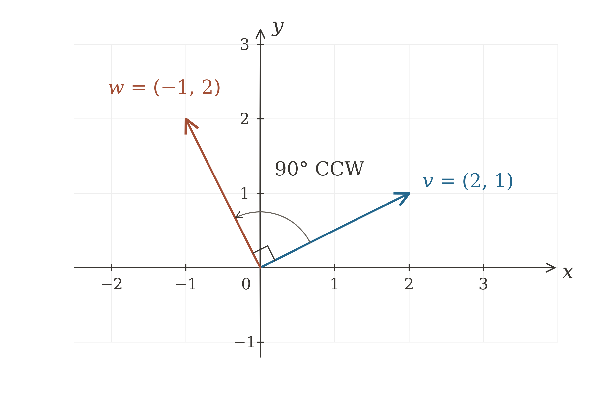

Source: [Khan Academy — Linear Combinations and Span](https://www.khanacademy.org/math/linear-algebra)

A linear combination of $v_1,\dotsc,v_n$ is any vector of the form

$$
c_1v_1+c_2v_2+\cdots+c_nv_n,
\qquad c_1,\dotsc,c_n\in\mathbb{R}.
$$

## Span

The span of a set of vectors is the set of all their linear combinations. Two non-parallel vectors in $\mathbb{R}^2$ span all of $\mathbb{R}^2$.

$$
\operatorname{span}(v_1, \dotsc,  v_n)
=
\left\{
c_1v_1+c_2v_2+\cdots+c_nv_n
\;\middle|\;
c_i\in\mathbb{R} \text{ for }1\le i\le n
\right\}
$$

### Examples with collinear vectors

As @fig-vector-linear-combinations-and-span-001 shows, the collinear vectors $\vec{v}$ and $\vec{w}$ lie on the same line through the origin.

{#fig-vector-linear-combinations-and-span-001 width=80% fig-pos="H"}

<!-- pagebreak -->

### Examples with non-parallel vectors

Two perpendicular, nonzero vectors give two independent directions in the plane.
We can construct such a pair by rotating one vector through $90^\circ$
counterclockwise. Start with

$$
\vec v=\begin{bmatrix}2\\1\end{bmatrix},
\qquad
A=\begin{bmatrix}0&-1\\1&0\end{bmatrix}.
$$

The matrix $A$ sends $(x,y)$ to $(-y,x)$. Applying it to $\vec v$ gives

$$
\vec w=A\vec v
=\begin{bmatrix}0&-1\\1&0\end{bmatrix}
 \begin{bmatrix}2\\1\end{bmatrix}
=\begin{bmatrix}-1\\2\end{bmatrix}.
$$

Thus $\vec w$ is the rotated image of $\vec v$, as shown in
@fig-vector-linear-combinations-and-span-002. Their dot product confirms that
they are perpendicular:

$$
\vec v\cdot\vec w=2(-1)+1(2)=0.
$$

Both vectors have length $\sqrt{5}$, since a rotation preserves length.
They span all of $\mathbb R^2$. Perpendicularity makes this example especially
simple, but any two non-parallel vectors in $\mathbb R^2$ span the plane.

{#fig-vector-linear-combinations-and-span-002 width=80% fig-pos="H"}

<!-- pagebreak -->

Suppose we want to express the vector

$$
\vec{u}
=
\begin{bmatrix}
1 \\ 3
\end{bmatrix}
$$

as a linear combination of $\vec{v}$ and $\vec{w}$.

In general form, we could set it up like:

$$
c_1
\begin{bmatrix}
2\\1
\end{bmatrix}
+
c_2
\begin{bmatrix}
-1\\2
\end{bmatrix}
=
\begin{bmatrix}
x_1\\x_2
\end{bmatrix}
$$ {#eq-span-general}

This creates a system of two unknowns:

$$
2c_1 - c_2 = x_1
$$ {#eq-span-x1}

$$
c_1 + 2c_2 = x_2
$$ {#eq-span-x2}

Twice @eq-span-x1 plus @eq-span-x2 gives $5c_1=2x_1+x_2$.
Twice @eq-span-x2 minus @eq-span-x1 gives $5c_2=-x_1+2x_2$. Hence:

$$
c_1 = \frac{2x_1+x_2}{5}
$$ {#eq-span-c1}

$$
c_2 = \frac{-x_1+2x_2}{5}
$$ {#eq-span-c2}

Substituting $x_1=1$ and $x_2=3$ into @eq-span-c1 and @eq-span-c2, we obtain $c_1=c_2=1$:

$$
1
\cdot
\begin{bmatrix}
2\\1
\end{bmatrix}
+
1
\cdot
\begin{bmatrix}
-1\\2
\end{bmatrix}
=
\begin{bmatrix}
1\\3
\end{bmatrix}
$$

Therefore, $\vec u=\vec v+\vec w$. The formulas above provide coefficients for every $(x_1,x_2)\in\mathbb R^2$, confirming that $\operatorname{span}(\vec v,\vec w)=\mathbb R^2$.

<!-- pagebreak -->

- General vector equation: @eq-span-general
- Component equations: @eq-span-x1 and @eq-span-x2
- Scalar coefficients: @eq-span-c1 and @eq-span-c2

<!-- pagebreak -->
