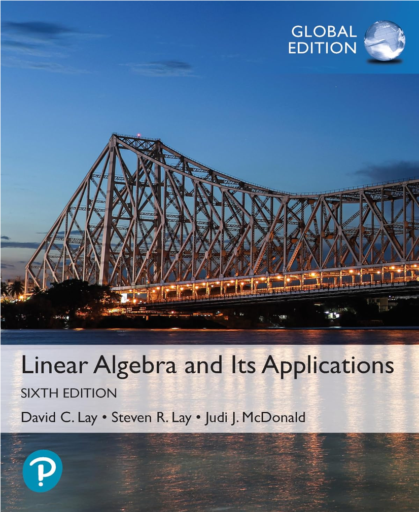

This chapter serves as an index to all the theorems found in the textbook, *6th edition of linear algebra and its applications*. Some of them have explanations, whenever I found it necessary.

{#fig-vectors-example width=25% fig-pos="H" fig-align="left"}

## Chapter 1.2 – Row Reduction and Echelon Forms

::: {#nte-uniqueness-ref .callout-note title="Uniqueness of the Reduced Echelon Form"}

**Textbook reference:** p.38

Each matrix is row equivalent to one and only one reduced echelon matrix.

:::

::: {#nte-existence-and-uniqueness .callout-note title="Existence and Uniqueness Theorem"}

**Textbook reference:** p.46

A linear system is consistent if and only if the rightmost column of the augmented matrix is *not* a pivot column - that is, if and only if an echelon form of the augmented matrix has *no* row on the form

$$
\left[
0 \; \cdots \; 0 \mid b
\right]
\qquad
\text{where } b \ne 0
$$

If a linear system is consistent, then the solution set contains either:

(i) A unique solution, when there are no free variables
(ii) Infinitely many solutions, when there are at least one free variable

::: {.content-visible when-format="html"}

***

:::

::: {.content-visible when-format="pdf"}

\noindent\rule{\linewidth}{0.5pt}

:::

A system of linear equations is said to be **homogeneous** if it can be written on the form $A\vec{x}=\vec{0}$, where $A$ is an $m \times n$ matrix and $\vec{0}$ is the zero vector in $\mathbb{R}^n$. Such a system $A\vec{x}=\vec{0}$ *always* has at least one solution, namely $\vec{x}=\vec{0}$ (the zero vector in $\mathbb{R}^n$). This zero solution is usually called the **trivial solution**. For a given equation $A\vec{x}=\vec{0}$, the important question is whether there exists a **nontrivial solution**, that is, a nonzero vector $\vec{x}$ that satisfies $A\vec{x}=\vec{0}$. @nte-existence-and-uniqueness leads to the following fact:

> The homogeneous equation $A\vec{x}=\vec{0}$ has a nontrivial solution if and only if the equation has at least one free variable.

An indexed set of vectors $\{\vec{v}_1, \cdots, \vec{v}_p\}$ in $\mathbb{R}^n$ are said to be **linearly independent** if the vector equation

$$
x_1\vec{v}_1
+
x_2\vec{v}_2
+
\cdots
+
x_p\vec{v}_p
=
0
$$

has only the trivial solution. The set $\{\vec{v}_1, \cdots, \vec{v}_p\}$ is said to be **linearly dependent** if there exists weights $c_1, \cdots, c_p$, not all zeros, such that

$$
c_1\vec{v}_1
+
c_2\vec{v}_2
+
\cdots
+
c_p\vec{v}_p
=
0
$$

:::

## Chapter 1.4 – The Matrix Equation $A\vec{x}=\vec{b}$

::: {#nte-theorem-3 .callout-note title="Matrix, Vector, and System Equivalence"}

**Textbook reference:** p.62

If $A$ is an $m \times n$ matrix, with columns $\vec{a}_1, \cdots \vec{a}_n$, and if $\vec{b}$ is in $\mathbb{R}^m$, the matrix equation

$$
A
\vec{x}
=
\vec{b}
$$

has the same solution set as the vector equation

$$
x_1\vec{a}_1
+
x_2\vec{a}_2
+
\cdots
+
x_n\vec{a}_n
=
\vec{b}
$$

which, in turn, has the same solution set as the system of linear equations whose augmented matrix is

$$
\begin{bmatrix}
\vec{a}_1 &
\vec{a}_2 &
\cdots
&
\vec{a}_n
\mid
\vec{b}
\end{bmatrix}
$$

:::

::: {#nte-theorem-4 .callout-note title="Equivalent Conditions for Spanning $\mathbb{R}^m$"}

**Textbook reference:** p.63

Let $A$ be an $m \times n$ matrix. Then the following statements are logically equivalent. That is, for for a particula $A$, either they are all true statements or they are all false.

a. For each $\vec{b}$ in $\mathbb{R}^m$, the equation $A\vec{x}=\vec{b}$ has a solution.
b. Each $\vec{b}$ in $\mathbb{R}^m$ is a linear combination of the columns of $A$.
c. The columns of $A$ span $\mathbb{R}^m$.
d. $A$ has a pivot position in every row.

:::

::: {#nte-theorem-5 .callout-note title="Linearity of Matrix-Vector Multiplication"}

**Textbook reference:** p.65

If $A$ is an $m \times n$ matrix, $\vec{u}$ and $\vec{v}$ are vectors in $\mathbb{R}^m$, and $c$ is a scalar, then:

a. $A(\vec{u}+\vec{v}) = A\vec{u}+A\vec{v}$
b. $A(c\vec{u}) = c(A\vec{u})$

:::

## Chapter 1.5 – Solution Sets of Linear Systems

::: {#nte-theorem-6 .callout-note title="Solution Set of a Consistent Linear System"}

**Textbook reference:** p.73

Suppose the equation $A\vec{x}=\vec{b}$ is consistent for some given $\vec{b}$, and let $\vec{p}$ be a solution. Then the solution set of $A\vec{x}=\vec{b}$ is the set of all vectors of the form $\vec{w}=\vec{p}+\vec{v}_h$, where $\vec{v}_h$ is any solution of the homogenous equation $A\vec{x}=0$.

:::

## Chapter 1.7 – Linear Independence

::: {#nte-theorem-7 .callout-note title="Characterization of Linearly Dependent Sets"}

**Textbook reference:** p.86

An indexed set $S= \{ \vec{v}_1, \cdots, \vec{v}_p \}$ of two or more vectors is linearly dependent if and only if at least one of the vectors in $S$ is a linear combination of the others. In fact, if $S$ is linearly dependent and $\vec{v}_1 \ne 0$, then some $\vec{v}_j \text{ ( with }j > 1)$ is a linear combination of the preceding vectors, $\vec{v}_1, \cdots, \vec{v}_{j-1}$.

:::

::: {#nte-theorem-8 .callout-note title="Theorem 8"}

**Textbook reference:** p.87

If a set contains more vectors than there are entries in each vector, then the set is linearly dependent. That is, any set $\{ \vec{v}_1, \cdots, \vec{v}_p\}$ in $\mathbb{R}^n$ is linearly dependent if $p>n$.

:::

::: {#nte-theorem-9 .callout-note title="Theorem 9"}

**Textbook reference:** p.87

 If a set $\{ \vec{v}_1, \cdots, \vec{v}_p\}$ in $\mathbb{R}^n$ contains the zero vector, then the set is linearly dependent.

::: {.content-visible when-format="html"}

***

:::

::: {.content-visible when-format="pdf"}

\noindent\rule{\linewidth}{0.5pt}

:::

 Suppose we have:

 $$
\vec{v}_1
=
\begin{bmatrix}
1 \\
2
\end{bmatrix}
,
\quad
\vec{v}_2
=
\begin{bmatrix}
0 \\
0
\end{bmatrix}
$$

We could write:

$$
0\vec{v}_1
+
1\vec{v}_2
=
\vec{0}
$$

Because one coefficient is nonzero, this is a nontrivial (see @nte-existence-and-uniqueness) linear combination that equals $\vec{0}$. Therefore the set is linearly dependent.

:::
