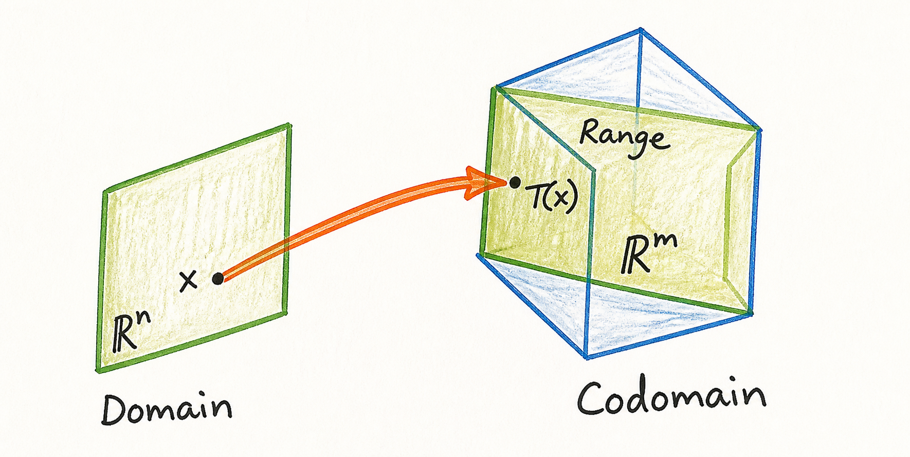
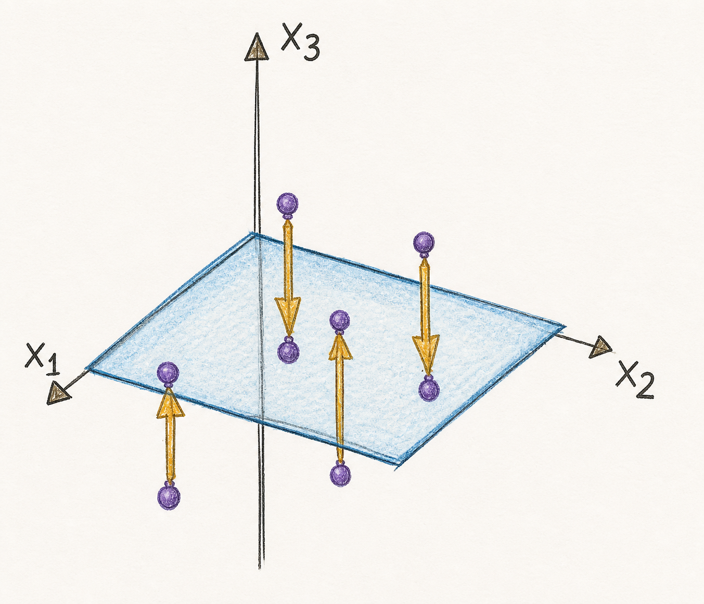
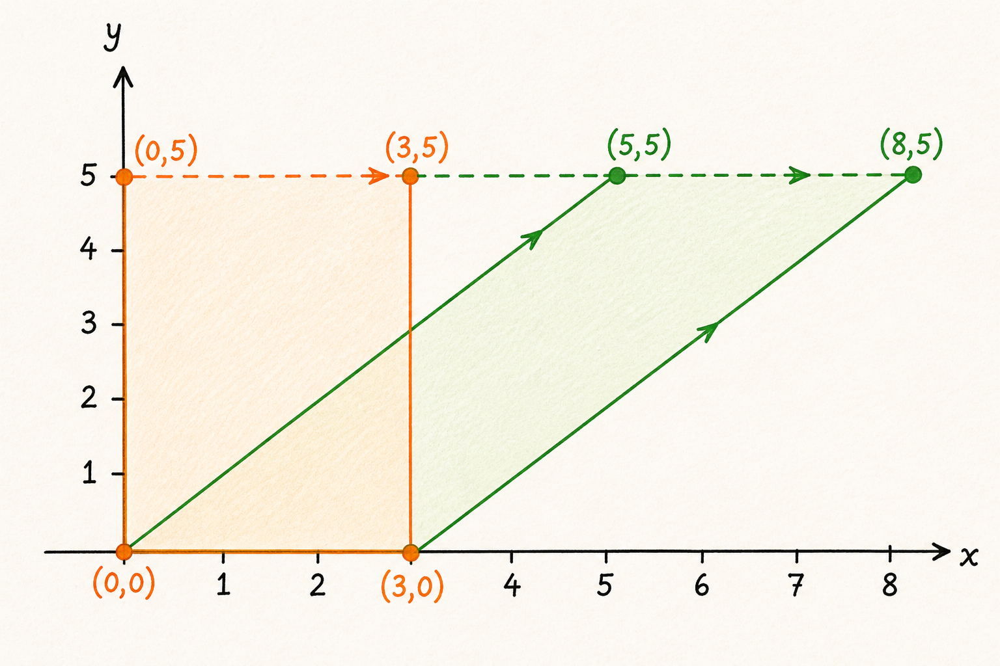

A linear transformation describes how vectors are mapped from one vector space
to another. Matrix multiplication provides a concrete way to define and compute
such transformations.

## Transformations between vector spaces

A transformation, also called a function or mapping, from $\mathbb{R}^n$ to
$\mathbb{R}^m$ is written

$$
T : \mathbb{R}^n \to \mathbb{R}^m
$$

For each input vector $\vec{x}\in\mathbb{R}^n$, the transformation assigns one
output vector $T(\vec{x})\in\mathbb{R}^m$.

- $\mathbb{R}^n$ is the **domain**: the set of permitted input vectors.
- $\mathbb{R}^m$ is the **codomain**: the vector space in which output vectors
  lie.
- $T(\vec{x})$ is the **image** of $\vec{x}$ under $T$.
- The **range** of $T$ is the set of outputs that $T$ can actually produce:

  $$
  \operatorname{range}(T)
  =
  \{\,T(\vec{x}) : \vec{x}\in\mathbb{R}^n\,\}
  $$

The range is always a subset of the codomain. A transformation need not reach
every vector in its codomain.

{#fig-linear-transformations-domain-codomain-range width=50% fig-pos="H" fig-align="center"}

## Matrix transformations

An $m\times n$ matrix $A$ defines a transformation

$$
T : \mathbb{R}^n \to \mathbb{R}^m,
\qquad
T(\vec{x})=A\vec{x}
$$

When the matrix $A$ is understood from context, this matrix transformation is
often denoted more compactly by

$$
\vec{x}\mapsto A\vec{x}
$$

The number of columns of $A$ is $n$, so multiplication by $A$ accepts vectors
from $\mathbb{R}^n$. The number of rows is $m$, so the result belongs to
$\mathbb{R}^m$. Every transformation defined by matrix multiplication is
linear: it preserves vector addition and scalar multiplication.

$$
T(\vec{u}+\vec{v})=T(\vec{u})+T(\vec{v}),
\qquad
T(c\vec{u})=cT(\vec{u}),
$$

or, if we want to describe it in one equation:

$$
T(c\vec{v}+d\vec{w}) = cT(\vec{v}) + dT(\vec{w})
$$

Consider the matrix

$$
A=
\begin{bmatrix}
1 & -3 \\
3 & 5 \\
-1 & 7
\end{bmatrix}
$$

Because $A$ has three rows and two columns, it defines a transformation from
$\mathbb{R}^2$ to $\mathbb{R}^3$:

$$
T : \mathbb{R}^2 \to \mathbb{R}^3,
\qquad
T\!\left(
\begin{bmatrix}
x_1 \\
x_2
\end{bmatrix}
\right)
=
\begin{bmatrix}
x_1-3x_2 \\
3x_1+5x_2 \\
-x_1+7x_2
\end{bmatrix}
$$

## Finding an image

To find the image of an input vector, multiply the matrix by that vector. Let

$$
\vec{u}=
\begin{bmatrix}
2 \\
-1
\end{bmatrix}
$$

Then

$$
\begin{aligned}
T(\vec{u})
&=A\vec{u} \\
&=
\begin{bmatrix}
1 & -3 \\
3 & 5 \\
-1 & 7
\end{bmatrix}
\begin{bmatrix}
2 \\
-1
\end{bmatrix} \\
&=
\begin{bmatrix}
5 \\
1 \\
-9
\end{bmatrix}
\end{aligned}
$$

Thus, $T$ maps the vector $(2,-1)^T$ in the domain to the vector
$(5,1,-9)^T$ in the codomain.

## Finding a preimage

Finding a vector $\vec{x}$ whose image is a specified vector $\vec{b}$ means
solving

$$
T(\vec{x})=\vec{b}
$$

For a matrix transformation, this is the matrix equation

$$
A\vec{x}=\vec{b}
$$

Let

$$
\vec{b}=
\begin{bmatrix}
3 \\
2 \\
-5
\end{bmatrix}
$$

Row-reducing the augmented matrix gives

$$
\left[
\begin{array}{cc|c}
1 & -3 & 3 \\
3 & 5 & 2 \\
-1 & 7 & -5
\end{array}
\right]
\xrightarrow[
R_3\leftarrow R_3+R_1
]{R_2\leftarrow R_2-3R_1}
\left[
\begin{array}{cc|c}
1 & -3 & 3 \\
0 & 14 & -7 \\
0 & 4 & -2
\end{array}
\right]
\xrightarrow[
R_3\leftarrow \tfrac14R_3
]{R_2\leftarrow \tfrac1{14}R_2}
\left[
\begin{array}{cc|c}
1 & -3 & 3 \\
0 & 1 & -\tfrac12 \\
0 & 1 & -\tfrac12
\end{array}
\right]
$$

$$
\xrightarrow[
R_1\leftarrow R_1+3R_2
]{R_3\leftarrow R_3-R_2}
\left[
\begin{array}{cc|c}
1 & 0 & \tfrac32 \\
0 & 1 & -\tfrac12 \\
0 & 0 & 0
\end{array}
\right]
$$

Therefore,

$$
\vec{x}=
\begin{bmatrix}
\tfrac32 \\
-\tfrac12
\end{bmatrix}
$$

is a preimage of $\vec{b}$. There are no free variables, so it is the unique
solution. A direct check confirms the result:

$$
A
\begin{bmatrix}
\tfrac32 \\
-\tfrac12
\end{bmatrix}
=
\begin{bmatrix}
3 \\
2 \\
-5
\end{bmatrix}
=\vec{b}
$$

## Testing whether a vector is in the range

A vector $\vec{c}\in\mathbb{R}^3$ belongs to $\operatorname{range}(T)$ if and
only if the equation $A\vec{x}=\vec{c}$ is consistent. In other words, testing
membership in the range is another system-of-equations problem.

Let

$$
\vec{c}=
\begin{bmatrix}
3 \\
2 \\
5
\end{bmatrix}
$$

The same initial row operations produce

$$
\left[
\begin{array}{cc|c}
1 & -3 & 3 \\
3 & 5 & 2 \\
-1 & 7 & 5
\end{array}
\right]
\xrightarrow[
R_3\leftarrow R_3+R_1
]{R_2\leftarrow R_2-3R_1}
\left[
\begin{array}{cc|c}
1 & -3 & 3 \\
0 & 14 & -7 \\
0 & 4 & 8
\end{array}
\right]
\xrightarrow[
R_3\leftarrow \tfrac14R_3
]{R_2\leftarrow \tfrac1{14}R_2}
\left[
\begin{array}{cc|c}
1 & -3 & 3 \\
0 & 1 & -\tfrac12 \\
0 & 1 & 2
\end{array}
\right]
$$

Subtracting the second row from the third gives

$$
\left[
\begin{array}{cc|c}
1 & -3 & 3 \\
0 & 1 & -\tfrac12 \\
0 & 0 & \tfrac52
\end{array}
\right]
$$

The final row represents the impossible equation

$$
0=\tfrac52
$$

Thus, $A\vec{x}=\vec{c}$ is inconsistent, so $\vec{c}$ is not in the range of
$T$.

## Example 2: Projection onto the $x_1x_2$-plane

Consider the matrix

$$
P=
\begin{bmatrix}
1 & 0 & 0 \\
0 & 1 & 0 \\
0 & 0 & 0
\end{bmatrix}.
$$

It defines a transformation from $\mathbb{R}^3$ to $\mathbb{R}^3$:

$$
\begin{bmatrix}
x_1 \\
x_2 \\
x_3
\end{bmatrix}
\mapsto
P
\begin{bmatrix}
x_1 \\
x_2 \\
x_3
\end{bmatrix}
=
\begin{bmatrix}
x_1 \\
x_2 \\
0
\end{bmatrix}.
$$

The transformation leaves the $x_1$- and $x_2$-coordinates unchanged and
replaces the $x_3$-coordinate with zero. It therefore projects every point in
$\mathbb{R}^3$ vertically onto the $x_1x_2$-plane.

@fig-linear-transformations-plane-and-vectors illustrates the geometric idea:
points above or below the plane map to the point directly above or below them on
the plane.

{#fig-linear-transformations-plane-and-vectors width=40% fig-pos="H" fig-align="center"}

The range of this transformation is the $x_1x_2$-plane itself:

$$
\operatorname{range}(P)
=
\left\{
\begin{bmatrix}
x_1 \\
x_2 \\
0
\end{bmatrix}
: x_1,x_2\in\mathbb{R}
\right\}.
$$

## Example 3: Horizontal shear

Let

$$
A=
\begin{bmatrix}
1 & k \\
0 & 1
\end{bmatrix}
$$

The associated transformation $T : \mathbb{R}^2\to\mathbb{R}^2$ is a
horizontal shear:

$$
T\!\left(
\begin{bmatrix}
x \\
y
\end{bmatrix}
\right)
=
\begin{bmatrix}
1 & k \\
0 & 1
\end{bmatrix}
\begin{bmatrix}
x \\
y
\end{bmatrix}
=
\begin{bmatrix}
x+ky \\
y
\end{bmatrix}
$$

The $y$-coordinate is unchanged, while the $x$-coordinate shifts by an amount
proportional to $y$. The $x$-axis, where $y=0$, is held fixed. The constant $k$
is the **shear factor**: positive values move points with positive $y$ to the
right, while negative values move them to the left.

For $k=1$, consider the rectangle with vertices

$$
\begin{bmatrix}0 \\ 0\end{bmatrix}
\qquad
\begin{bmatrix}3 \\ 0\end{bmatrix}
\qquad
\begin{bmatrix}0 \\ 5\end{bmatrix}
\qquad
\begin{bmatrix}3 \\ 5\end{bmatrix}
$$

The two vertices on the base remain fixed:

$$
T\!\left(
\begin{bmatrix}0 \\ 0\end{bmatrix}
\right)
=
\begin{bmatrix}0 \\ 0\end{bmatrix}
\qquad
T\!\left(
\begin{bmatrix}3 \\ 0\end{bmatrix}
\right)
=
\begin{bmatrix}3 \\ 0\end{bmatrix}
$$

The upper vertices shift five units to the right:

$$
T\!\left(
\begin{bmatrix}0 \\ 5\end{bmatrix}
\right)
=
\begin{bmatrix}5 \\ 5\end{bmatrix}
\qquad
T\!\left(
\begin{bmatrix}3 \\ 5\end{bmatrix}
\right)
=
\begin{bmatrix}8 \\ 5\end{bmatrix}
$$

@fig-linear-transformations-horizontal-shear shows the original rectangle and
its image under this transformation. The base remains fixed, while each point
above it moves horizontally to the right.

{#fig-linear-transformations-horizontal-shear width=75% fig-pos="H" fig-align="center"}

Thus, the rectangle becomes a parallelogram. The transformation changes its
shape without changing its area because

$$
\det(A)=1
$$

## Summary

- An $m\times n$ matrix defines a linear transformation from
  $\mathbb{R}^n$ to $\mathbb{R}^m$.
- The image of $\vec{x}$ is found by computing $A\vec{x}$.
- A preimage of $\vec{b}$ is a solution of $A\vec{x}=\vec{b}$.
- A vector belongs to the range of $T$ exactly when the corresponding matrix
  equation is consistent.
- A projection can map all of $\mathbb{R}^3$ onto a plane, while a shear shifts
  points parallel to a fixed axis or plane.
