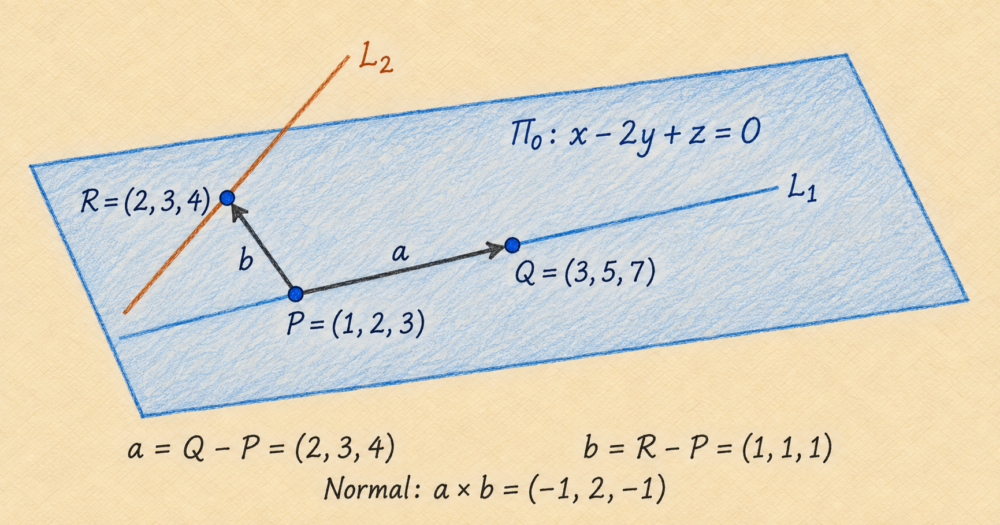
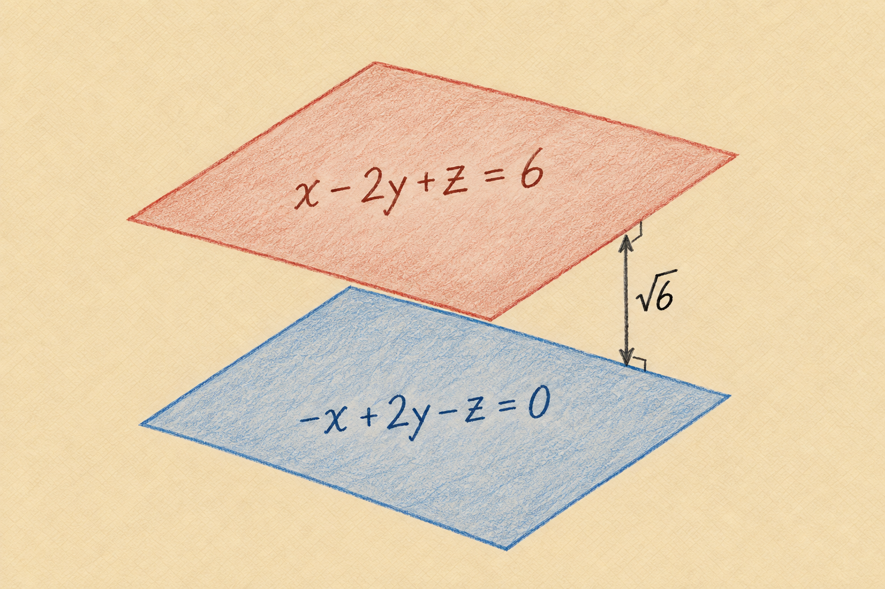

The distance between two planes is the shortest distance between any point
on one plane and any point on the other. If the planes intersect, this
distance is zero. Distinct parallel planes have a positive separation,
measured perpendicular to both planes, along a common normal direction.

This worked example starts with a plane specified by two lines. We first
find its equation, then use the given separation to locate a parallel plane.

## Problem

The distance between the plane

$$
\Pi_d:\quad Ax-2y+z=d
$$

and the plane $\Pi_0$ containing the lines

$$
L_1:\quad \frac{x-1}{2}=\frac{y-2}{3}=\frac{z-3}{4},
\qquad
L_2:\quad \frac{x-2}{3}=\frac{y-3}{4}=\frac{z-4}{5}
$$

is $\sqrt{6}$. Find $|d|$.

Here $A$ and $d$ are unknown scalar coefficients. We use $P$, $Q$, and $R$
for points to avoid confusing a point label with the coefficient $A$.

## Find points and directions in the plane

Setting each ratio in $L_1$ equal to a parameter $t$ gives

$$
(x,y,z)=(1,2,3)+t(2,3,4).
$$

At $t=0$ and $t=1$, respectively, we obtain

$$
P=(1,2,3),\qquad Q=(3,5,7).
$$

Similarly, the second line has the parametrization

$$
(x,y,z)=(2,3,4)+s(3,4,5).
$$

Taking $s=0$ gives a third point $R=(2,3,4)$. Subtracting the
coordinates of $P$ produces two directions within the plane:

$$
\vec a=Q-P=(2,3,4),\qquad
\vec b=R-P=(1,1,1).
$$

These vectors are not scalar multiples, so the three points are not
collinear and determine a unique plane. @fig-planes-construction shows
the points and the two directions.

{#fig-planes-construction width=95% fig-align="center"}

We should also check that this plane contains the *whole* second line,
not just $R$. Its direction is

$$
(3,4,5)=\vec a+\vec b.
$$

Thus $L_2$ passes through $R$ and follows a direction in the plane.
The first line passes through $P$ with direction $\vec a$, so both lines
are contained in the plane we have constructed.

## Find a normal and the plane equation

The cross product of two independent directions is perpendicular to both,
so a normal vector is

$$
\begin{aligned}
\vec n_0=\vec a\times\vec b
&=\begin{vmatrix}
\hat{\imath}&\hat{\jmath}&\hat{k}\\
2&3&4\\
1&1&1
\end{vmatrix}\\
&=(3-4)\hat{\imath}-(2-4)\hat{\jmath}+(2-3)\hat{k}\\
&=(-1,2,-1).
\end{aligned}
$$

For any point $(x,y,z)$ in the plane, its displacement from the known
point $Q=(3,5,7)$ is perpendicular to $\vec n_0$. Therefore,

$$
\vec n_0\cdot(x-3,y-5,z-7)=0.
$$

Expanding gives

$$
-(x-3)+2(y-5)-(z-7)=0
\quad\Longrightarrow\quad
-x+2y-z=0.
$$

Multiplying the whole equation by $-1$ describes the same plane:

$$
\boxed{\Pi_0:\quad x-2y+z=0.}
$$

## Use parallelism to determine A

The stated distance is positive, so the two planes cannot intersect.
Their normals must therefore be parallel. Using the equation above,
we can compare the normals

$$
\vec n=(1,-2,1),\qquad \vec n_d=(A,-2,1).
$$

Parallel normals are scalar multiples:

$$
(A,-2,1)=\lambda(1,-2,1).
$$

The third component gives $\lambda=1$, and the first then gives $A=1$.
The planes consequently have equations

$$
\Pi_0:\quad x-2y+z=0,
\qquad
\Pi_d:\quad x-2y+z=d.
$$

Only the normal coefficients must be proportional for parallelism. The
right-hand constants determine the planes' positions and need not be equal.

## Calculate the perpendicular distance

For a plane $ax+by+cz=D$ with nonzero normal $(a,b,c)$, the distance
from a point $P_0=(x_0,y_0,z_0)$ is

$$
\operatorname{dist}(P_0,\Pi)
=\frac{|ax_0+by_0+cz_0-D|}{\sqrt{a^2+b^2+c^2}}.
$$

This formula measures the magnitude of the displacement along the unit
normal. Dividing by the normal's length removes the arbitrary scaling of
the plane equation; the absolute value makes the distance nonnegative.
The derivation is given in [Point Distance to a Plane](07-point-distance-to-plane.md).

Because our planes are parallel, we may choose any point on $\Pi_0$ and
calculate its distance to $\Pi_d$. Using $P=(1,2,3)$,

$$
\operatorname{dist}(\Pi_0,\Pi_d)
=\frac{|1-2(2)+3-d|}{\sqrt{1^2+(-2)^2+1^2}}
=\frac{|d|}{\sqrt{6}}.
$$

The given distance is $\sqrt{6}$, so

$$
\frac{|d|}{\sqrt{6}}=\sqrt{6}
\quad\Longrightarrow\quad
\boxed{|d|=6.}
$$

Both $d=6$ and $d=-6$ satisfy the condition. They describe planes on
opposite sides of $\Pi_0$. @fig-planes-separation illustrates the $d=6$
case; the other solution lies at the same distance on the opposite side.

{#fig-planes-separation width=85% fig-align="center"}

## General rule and summary

If two parallel planes are written with the **same normal coefficients**,

$$
ax+by+cz=D_1,\qquad ax+by+cz=D_2,
$$

their separation is

$$
\boxed{\operatorname{dist}(\Pi_1,\Pi_2)
=\frac{|D_2-D_1|}{\sqrt{a^2+b^2+c^2}}.}
$$

If their equations initially use different scalar multiples of the normal,
rescale one equation before subtracting the constants.

The method in this example is to find two independent directions, take
their cross product to obtain a normal, and use a known point to form the
plane equation. A positive separation then forces parallelism, and a
point-to-plane distance calculation gives the answer. The normal controls
orientation; the constant controls position along that normal direction.

## Source

Adapted from pages 1–3 of the author's
[handwritten notes on planes](../hand-written/planes.pdf), with the
distance calculation written using absolute values to retain both solutions.
