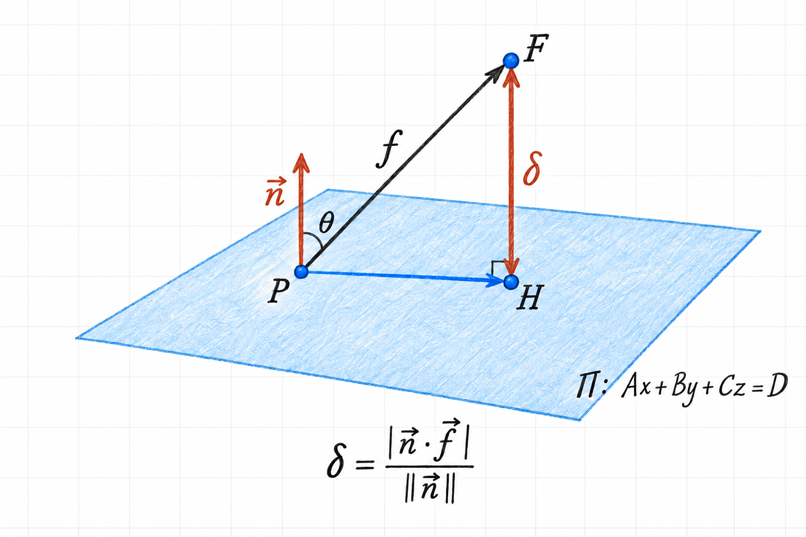

The distance from a point to a plane is the length of the shortest path
from the point to the plane. This path is perpendicular to the plane.
We can find its length by projecting a displacement vector onto the
plane's normal direction.

This explains the point-to-plane distance formula used in
[Distance Between Planes](06-distance-between-planes.md).

## Set up the geometry

Let the plane be

$$
\Pi:\quad Ax+By+Cz=D,
$$

with nonzero normal vector

$$
\vec n=\begin{bmatrix}A\\B\\C\end{bmatrix}.
$$

We want the distance from $F=(x_0,y_0,z_0)$ to $\Pi$. Choose any known
point $P=(x_p,y_p,z_p)$ on the plane, so that

$$
Ax_p+By_p+Cz_p=D.
$$

Write their position vectors as $\vec f_p$ and $\vec p_1$, respectively,
following the handwritten notes. The displacement **from $P$ to $F$** is

$$
\vec f=\vec f_p-\vec p_1
=\begin{bmatrix}
x_0-x_p\\y_0-y_p\\z_0-z_p
\end{bmatrix}.
$$

The point $P$ does not have to be the nearest point on the plane. Denote
that nearest point by $H$, the **perpendicular foot** of $F$ on $\Pi$.
@fig-point-plane-projection shows the displacement and its perpendicular
component. We use $\delta$ for the distance, keeping it distinct from the
constant $D$ in the plane equation.

{#fig-point-plane-projection width=90% fig-align="center"}

## Why the perpendicular component gives the shortest distance

The displacement from $P$ to $F$ can be split into two parts:

$$
\vec f=(H-P)+(F-H).
$$

The first part is parallel to the plane; the second is perpendicular to
it. These parts are orthogonal, so Pythagoras gives

$$
\|F-P\|^2=\|H-P\|^2+\|F-H\|^2.
$$

Moving the chosen point $P$ away from $H$ adds a nonnegative term.
The shortest displacement therefore occurs at $P=H$, and its length is
$\delta=\|F-H\|$. A sideways component can only make the path longer.

## Extract the distance using the dot product

Let $\theta$ be the angle between $\vec n$ and a nonzero displacement
$\vec f$. Its signed component along the normal direction is
$\|\vec f\|\cos\theta$. Taking the magnitude gives the distance:

$$
\delta=\left|\|\vec f\|\cos\theta\right|.
$$

We do not need to calculate $\theta$ explicitly. The dot-product identity

$$
\vec n\cdot\vec f=\|\vec n\|\,\|\vec f\|\cos\theta
$$

gives

$$
\delta=\frac{|\vec n\cdot\vec f|}{\|\vec n\|}.
$$

Equivalently, we take the dot product with the unit normal
$\hat n=\vec n/\|\vec n\|$ and keep its magnitude. This final expression
also works when $\vec f=\vec 0$, even though the angle is then undefined:
the distance is zero.

It is useful to distinguish three related quantities:

| Quantity | Expression | Meaning |
|---|---|---|
| Signed scalar component | $\displaystyle\frac{\vec n\cdot\vec f}{\|\vec n\|}$ | Displacement along the chosen normal direction, including its sign. |
| Vector projection | $\displaystyle\frac{\vec n\cdot\vec f}{\|\vec n\|^2}\vec n$ | The perpendicular displacement vector $F-H$. |
| Distance | $\displaystyle\frac{|\vec n\cdot\vec f|}{\|\vec n\|}$ | The nonnegative length of that vector. |

## Write the formula in coordinates

Expanding the numerator gives

$$
\begin{aligned}
\vec n\cdot\vec f
&=A(x_0-x_p)+B(y_0-y_p)+C(z_0-z_p)\\
&=Ax_0+By_0+Cz_0-(Ax_p+By_p+Cz_p)\\
&=Ax_0+By_0+Cz_0-D.
\end{aligned}
$$

The last equality uses the fact that $P$ is on the plane. Also,

$$
\|\vec n\|=\sqrt{A^2+B^2+C^2}.
$$

Consequently,

$$
\boxed{\operatorname{dist}(F,\Pi)
=\frac{|Ax_0+By_0+Cz_0-D|}{\sqrt{A^2+B^2+C^2}}.}
$$

The coordinates of $P$ have disappeared: any point on the plane gives
the same perpendicular component. Once we know the plane equation, we
can use the formula without first finding a point on the plane.

The absolute value matters because $F$ can lie on either side of $\Pi$.
Reversing the normal changes the signed component but leaves the distance
unchanged. Similarly, multiplying the entire plane equation by a nonzero
constant scales the numerator and denominator by the same absolute factor,
so it cannot change the distance.

## Worked example

Find the distance from $F=(2,1,3)$ to the plane

$$
\Pi:\quad x-2y+z=0.
$$

Here $(A,B,C)=(1,-2,1)$ and $D=0$, giving

$$
\delta
=\frac{|2-2(1)+3|}{\sqrt{1^2+(-2)^2+1^2}}
=\frac{3}{\sqrt{6}}
=\frac{\sqrt{6}}{2}.
$$

We can verify this by finding the perpendicular foot. The origin is on
the plane, so take $P=(0,0,0)$ and $\vec f=(2,1,3)$. The perpendicular
component is

$$
\operatorname{proj}_{\vec n}\vec f
=\frac{3}{6}(1,-2,1)
=\left(\frac12,-1,\frac12\right).
$$

Subtracting this component from $F$ gives

$$
H=F-\operatorname{proj}_{\vec n}\vec f
=\left(\frac32,2,\frac52\right).
$$

This point lies on the plane because $\frac32-2(2)+\frac52=0$.
The vector $F-H$ is parallel to the normal, and its length is

$$
\|F-H\|=\sqrt{\frac14+1+\frac14}=\frac{\sqrt6}{2},
$$

in agreement with the distance formula.

## Summary and interpretation

To measure distance to a plane, keep only the displacement along its
normal direction. The dot product performs this projection, division by
the normal's length normalizes the result, and the absolute value turns
the signed component into a distance.

In an engineering setting, the same calculation measures a point's
perpendicular deviation from a reference surface. The signed component
can also tell us which side of that surface the point occupies, once a
normal orientation has been chosen.

## Source

Adapted from page 4 of the author's
[handwritten notes on planes](../hand-written/planes.pdf). The illustration
redraws the sketch also saved as
[point-distance-to-plane.JPEG](../../images/point-distance-to-plane.JPEG),
with labels separating the displacement vector, its projection, and the
distance.
