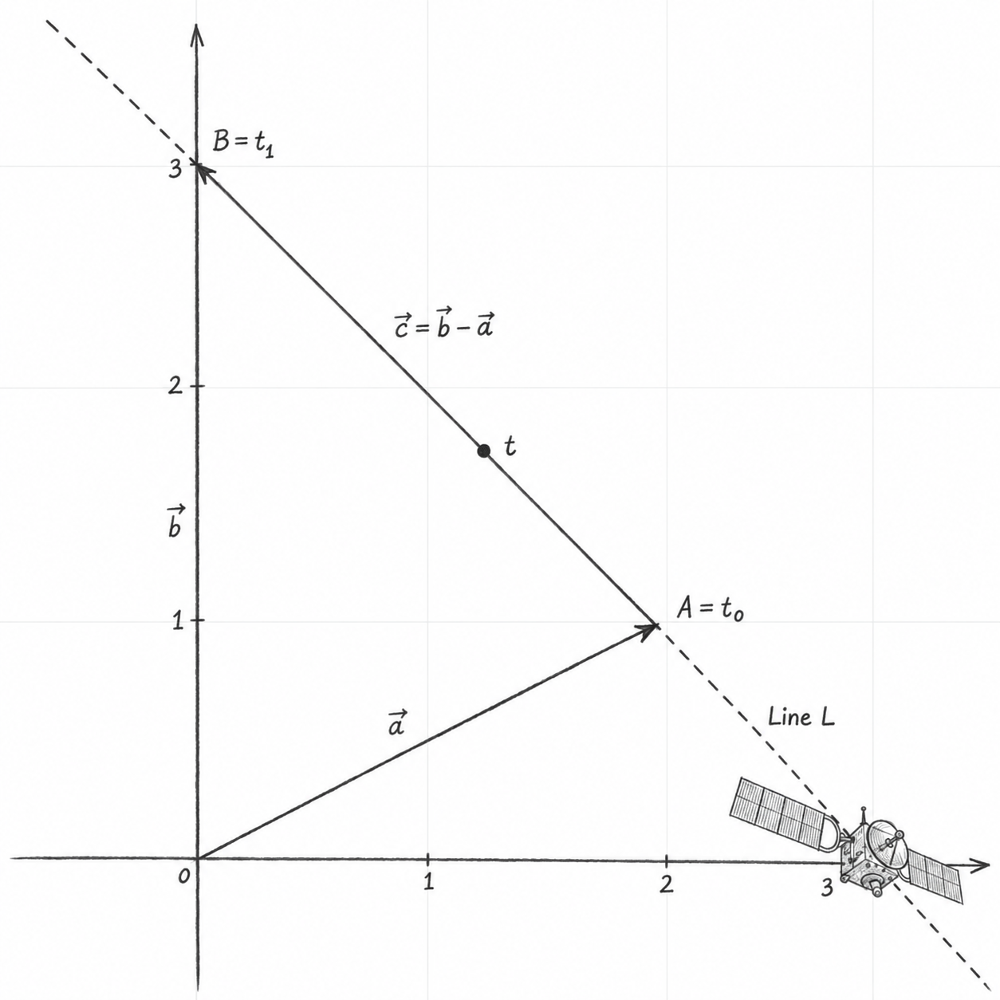

::: {.hidden}
$$
\def\blueD#1{\color{blue}{#1}}
\def\maroonD#1{\color{maroon}{#1}}
\def\greenD#1{\color{green}{#1}}
\def\redD#1{\color{red}{#1}}
\def\goldD#1{\color{orange}{#1}}
$$
:::

Vectors are used to represent many things around us: from forces like gravity, acceleration, friction, stress and strain on structures, to computer graphics used in almost all modern-day movies and video games. Vectors are an important concept, not just in math, but in physics, engineering, and computer graphics, so you're likely to see them again in other subjects.

Geometrically, a vector can be represented by a directed line segment, or arrow, whose direction indicates the vector’s direction and whose length represents its magnitude. Vectors are used, for example, to describe the velocity of a moving object.

The zero vector has magnitude zero and no defined direction. Vectors may also belong to a one-dimensional vector space. The zero vector is defined to be orthogonal to any other vector

## Notation

Vectors can be written in several ways:

$$
\begin{aligned}
\vec{v}
&= (1, 2, 3) \\
&= \begin{bmatrix}1\\2\\3\end{bmatrix} \\
&= \blueD{\hat{\imath}}+2\maroonD{\hat{\jmath}}+3\greenD{\hat{k}}
\end{aligned}
$$

A vector is often denoted by placing a small arrow above its name, as in $\vec{v}$.

Depending on the context, $(1,2,3)$ can represent either a point or a vector. When it represents a position vector, the vector is drawn from the origin to the corresponding point. A free vector, however, may be translated without changing the vector.

The second representation is called column-vector notation. In $n$ dimensions, a general column vector has the form

$$
\begin{bmatrix}
v_1 \\
v_2 \\
\vdots \\
v_n
\end{bmatrix}
$$

The third notation expresses a vector as a linear combination of standard basis vectors. Each standard basis vector has magnitude one.

In two dimensions, the standard basis vectors are
$\blueD{\hat{\imath}}=(1,0)$ and
$\maroonD{\hat{\jmath}}=(0,1)$.
They are pronounced “i-hat” and “j-hat”.

In three dimensions, the standard basis vectors are
$\blueD{\hat{\imath}}=(1,0,0)$,
$\maroonD{\hat{\jmath}}=(0,1,0)$, and
$\greenD{\hat{k}}=(0,0,1)$.

In $\mathbb{R}^n$, the standard basis vectors are usually denoted
$\mathbf e_1,\ldots,\mathbf e_n$.

This notation might make more sense once we cover vector addition.

Coordinate vectors can have any finite number of components. The space $\mathbb R^n$ has dimension $n$.

## Addition

Vectors can be added and subtracted provided that they belong to the same vector space. In $\mathbb R^n$, this means that they must have the same number of components. We add two vectors by adding their corresponding components. Say we have:

$$
\begin{aligned}
\vec{v} &= (v_1, v_2, \dots, v_n) \\
\vec{w} &= (w_1, w_2, \dots, w_n)
\end{aligned}
$$

then their sum is:

$$
\vec{v}+\vec{w}
= (v_1+w_1, v_2+w_2, \dots, v_n+w_n)
$$

The result of the addition (or subtraction) is another vector in $\mathbb{R}^n$.

Geometrically, $\greenD{\vec{v}}+\redD{\vec{w}}$ can be visualized by translating $\redD{\vec{w}}$ so that its tail lies at the tip of $\greenD{\vec{v}}$. The resulting vector spans from the tail of $\greenD{\vec{v}}$ to the tip of the translated $\redD{\vec{w}}$. The following example illustrates this.

Suppose we have two vectors:

$$
\begin{aligned}
\greenD{\vec{v}} &\greenD{= \begin{bmatrix} 3 \\ 1 \end{bmatrix}} \\
\redD{\vec{w}} &\redD{= \begin{bmatrix} -2 \\ 3 \end{bmatrix}}
\end{aligned}
$$

Then we get:

$$
\greenD{\vec{v}}+\redD{\vec{w}}
=
\left[
\begin{aligned}
\greenD{3} &{}+\redD{(-2)} \\
\greenD{1} &{}+\redD{3}
\end{aligned}
\right]
=
\begin{bmatrix}
\goldD{1} \\
\goldD{4}
\end{bmatrix}
$$

## Scalar multiplication

A scalar is simply a number. Scalar multiplication means multiplying each component of a vector by the scalar. If $c\in\mathbb R$ and $\vec{v}=(v_1,\ldots,v_n)$, then

$$
c\vec v=(cv_1,\ldots,cv_n).
$$

The resulting vector is collinear with the original vector, and its magnitude is
$$
\lVert c\vec v\rVert=|c|\lVert\vec v\rVert.
$$

If $c>0$, the direction remains the same; if $c<0$, the direction is reversed. If $c=0$, the result is the zero vector.

## Parametric representation of lines

During Algebra I, we learnt that non-vertical lines could be represented by:

$$
y=mx+b
$$

where $m$ is the slope and $b$ is the $y$-intercept. This form cannot represent vertical lines and does not generalise conveniently to higher-dimensional spaces. Parametric representations overcome both limitations.

Looking at @fig-vector-parametrization-004, suppose $\vec{a}$ and $\vec{b}$ are the position vectors of two distinct points along the dotted line $L$. The displacement vector pointing from $\vec{a}$ to $\vec{b}$ is:

$$
\vec{c} = {\vec{b} - \vec{a}}
$$

Adding every scalar multiple of $\vec{c}$ to $\vec{a}$ gives every point on the line:

$$
L
=
\{
\vec{a}
+
\lambda
\cdot
\vec{c}
\mid
\lambda
\in
\mathbb{R}
\}
$$

This gives:
$$
\lambda=0 \Longrightarrow \vec{a},
\qquad
\lambda=1 \Longrightarrow \vec{b}
$$

Also:

- $\lambda \in \mathbb{R}$ describes the entire line.
- $0 \leq \lambda \leq 1$ describes the segment from $\vec{a}$ to $\vec{b}$.

The parameter $\lambda$ identifies a position on the line. To describe the vessel’s motion over time, we make this parameter a function of time.

Suppose the vessel is at position $\vec{a}$ at time $t_0$ and at $\vec{b}$ at time $t_1$, where $t_1 > t_0$. Assuming constant velocity, its position at time $t$ is:

$$
\vec{r}(t)
=
\vec{a}
+
\frac{t-t_0}{t_1-t_0}
(\vec{b}-\vec{a})
$$

Here,

$$
\vec{v}
=
\frac{\vec{b}-\vec{a}}{t_1-t_0}
$$

is the vessel's velocity vector. Therefore, the same equation can be written as:

$$
\vec{r}(t)
=
\vec{a}
+
(t-t_0)
\vec{v}
$$

Note: the interpolation formula describes the observed journey when:

$$
t_0 \le t \le t_1
$$

Values of $t$ outside this interval extrapolate the constant-velocity motion.

{#fig-vector-parametrization-004 width=50% fig-pos="H"}

## Vector equations and span

::: {.callout-note title="Vector equation"}

The vector equation

$$
x_1\vec{a}_1+x_2\vec{a}_2+\cdots+x_n\vec{a}_n=\vec{b}
$$

has the same solution set as the linear system whose augmented matrix is

$$
\left[
\begin{array}{cccc|c}
\vec{a}_1 & \vec{a}_2 & \cdots & \vec{a}_n & \vec{b}
\end{array}
\right].
$$

In particular, $\vec{b}$ can be generated by a linear combination of
$\vec{a}_1,\ldots,\vec{a}_n$ if and only if the corresponding linear system
has a solution.

:::

::: {.callout-note title="Definition — Span"}

If $\vec{v}_1,\ldots,\vec{v}_p\in\mathbb{R}^n$, the set of all linear
combinations of these vectors is called the **subspace spanned** (or
**generated**) by $\vec{v}_1,\ldots,\vec{v}_p$. It is written

$$
\operatorname{span}\{\vec{v}_1,\ldots,\vec{v}_p\}
=
\left\{
c_1\vec{v}_1+c_2\vec{v}_2+\cdots+c_p\vec{v}_p
:c_1,\ldots,c_p\in\mathbb{R}
\right\}.
$$

:::

## Algebraic properties of $\mathbb{R}^n$

For all $\vec{u},\vec{v},\vec{w}\in\mathbb{R}^n$ and scalars $c$ and $d$,
vector addition and scalar multiplication obey the following rules:

$$
\begin{aligned}
\vec{u}+\vec{v} &= \vec{v}+\vec{u},
& (\vec{u}+\vec{v})+\vec{w} &= \vec{u}+(\vec{v}+\vec{w}), \\
\vec{u}+\vec{0} &= \vec{0}+\vec{u}=\vec{u},
& \vec{u}+(-\vec{u}) &= -\vec{u}+\vec{u}=\vec{0}, \\
c(\vec{u}+\vec{v}) &= c\vec{u}+c\vec{v},
& (c+d)\vec{u} &= c\vec{u}+d\vec{u}, \\
c(d\vec{u}) &= (cd)\vec{u},
& 1\vec{u} &= \vec{u}.
\end{aligned}
$$

Here, $-\vec{u}$ denotes $(-1)\vec{u}$. These properties justify the usual
algebraic manipulations of vector expressions.

## Parallelogram rule for addition

::: {.callout-note title="Parallelogram rule for addition"}

If $\vec{u}$ and $\vec{v}$ in $\mathbb{R}^2$ are represented as points in the
plane, then $\vec{u}+\vec{v}$ is the fourth vertex of the parallelogram whose
other vertices are $\vec{0}$, $\vec{u}$, and $\vec{v}$.

:::

This is equivalent to the tip-to-tail construction used above: translating one
vector preserves it, and the diagonal from the origin gives their sum.
