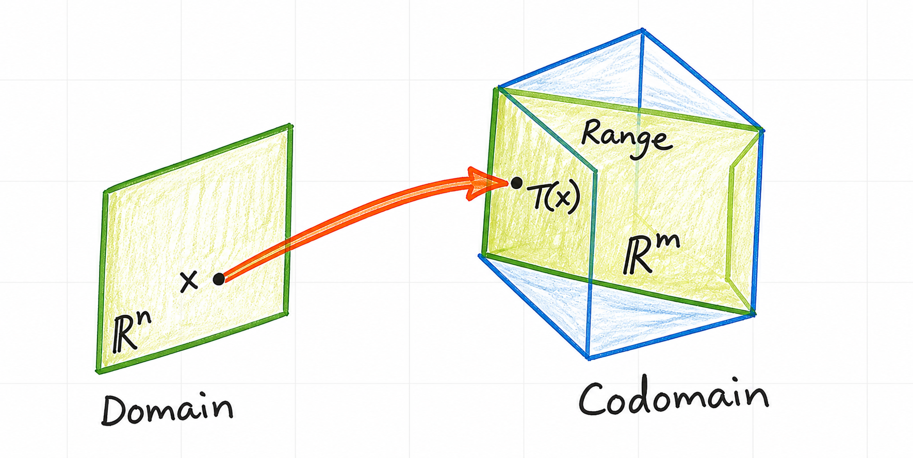
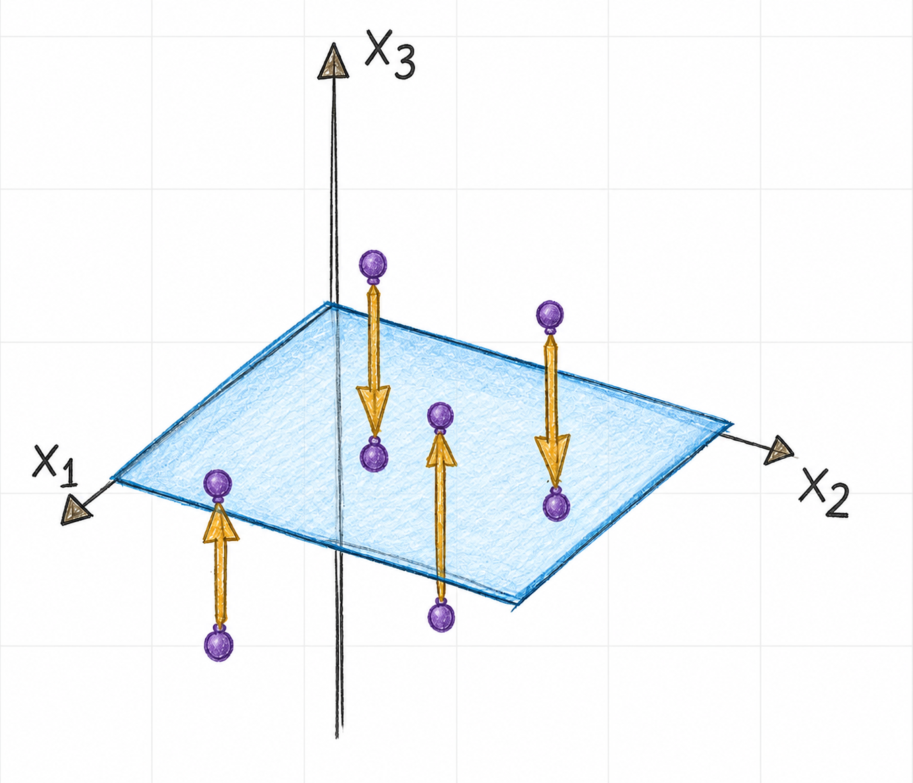
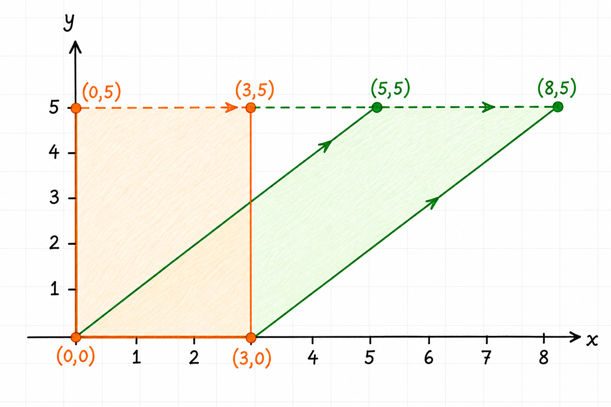

A transformation describes a rule for mapping vectors from one vector space to another. Linear transformations are especially important because they preserve the vector-space operations of addition and scalar multiplication. Matrices give a concrete and computationally useful representation of them.

## Transformations between vector spaces

A transformation, also called a function or mapping, from $\mathbb{R}^n$ to $\mathbb{R}^m$ is written

$$
T : \mathbb{R}^n \to \mathbb{R}^m
$$

For each input vector $\vec{x}\in\mathbb{R}^n$, the transformation assigns one output vector $T(\vec{x})\in\mathbb {R}^m$.

- $\mathbb{R}^n$ is the **domain**, the set of permitted input vectors.
- $\mathbb{R}^m$ is the **codomain**, the vector space in which output vectors lie.
- $T(\vec{x})$ is the **image** of $\vec{x}$ under $T$.
- The **range** of $T$ is the set of vectors that $T$ can actually produce:

  $$
  \operatorname{range}(T)
  =
  \{\,T(\vec{x}) : \vec{x}\in\mathbb{R}^n\,\}
  $$

The range is a subset of the codomain. A transformation need not reach every vector in its codomain, as illustrated in @fig-linear-transformations-domain-codomain-range.

{#fig-linear-transformations-domain-codomain-range width=50% fig-pos="H" fig-align="center"}

## Matrix transformations

An $m\times n$ matrix $A$ defines a transformation

$$
T : \mathbb{R}^n \to \mathbb{R}^m,
\qquad
T(\vec{x})=A\vec{x}
$$

The $n$ columns of $A$ determine the dimension of the domain, while its $m$ rows determine the dimension of the codomain. When $A$ is clear from context, the transformation is often written simply as

$$
\vec{x}\mapsto A\vec{x}
$$

Consider

$$
A=
\begin{bmatrix}
1 & -3 \\
3 & 5 \\
-1 & 7
\end{bmatrix}
$$

Because $A$ has three rows and two columns, it defines a transformation from
$\mathbb{R}^2$ to $\mathbb{R}^3$:

$$
T\!\left(
\begin{bmatrix}
x_1 \\
x_2
\end{bmatrix}
\right)
=
\begin{bmatrix}
1 & -3 \\
3 & 5 \\
-1 & 7
\end{bmatrix}
\begin{bmatrix}
x_1 \\
x_2
\end{bmatrix}
=
\begin{bmatrix}
x_1-3x_2 \\
3x_1+5x_2 \\
-x_1+7x_2
\end{bmatrix}
$$

### Finding an image

Let

$$
\vec{u}=
\begin{bmatrix}
2 \\
-1
\end{bmatrix}
$$

Its image is found by multiplying by $A$:

$$
\begin{aligned}
T(\vec{u})
&=A\vec{u} \\
&=
\begin{bmatrix}
1 & -3 \\
3 & 5 \\
-1 & 7
\end{bmatrix}
\begin{bmatrix}
2 \\
-1
\end{bmatrix} \\
&=
\begin{bmatrix}
5 \\
1 \\
-9
\end{bmatrix}
\end{aligned}
$$

Thus, $T$ maps $(2,-1)^T$ in the domain to $(5,1,-9)^T$ in the codomain.

## Preimages and the range

To find a vector whose image is a specified vector $\vec{b}$, solve

$$
T(\vec{x})=\vec{b}
$$

or, for a matrix transformation,

$$
A\vec{x}=\vec{b}
$$

For

$$
\vec{b}=
\begin{bmatrix}
3 \\
2 \\
-5
\end{bmatrix}
$$

row reduction gives

$$
\left[
\begin{array}{cc|c}
1 & -3 & 3 \\
3 & 5 & 2 \\
-1 & 7 & -5
\end{array}
\right]
\xrightarrow[
R_3\leftarrow R_3+R_1
]{R_2\leftarrow R_2-3R_1}
\left[
\begin{array}{cc|c}
1 & -3 & 3 \\
0 & 14 & -7 \\
0 & 4 & -2
\end{array}
\right]
\xrightarrow{}
\left[
\begin{array}{cc|c}
1 & 0 & \tfrac32 \\
0 & 1 & -\tfrac12 \\
0 & 0 & 0
\end{array}
\right]
$$

Therefore,

$$
\vec{x}=
\begin{bmatrix}
\tfrac32 \\
-\tfrac12
\end{bmatrix}
$$

is a preimage of $\vec{b}$. There are no free variables, so it is the unique preimage. In particular, $\vec{b}$ belongs to $\operatorname{range}(T)$.

To test whether a vector belongs to the range, solve the corresponding matrix
equation. For

$$
\vec{c}=
\begin{bmatrix}
3 \\
2 \\
5
\end{bmatrix}
$$

the augmented matrix reduces to

$$
\left[
\begin{array}{cc|c}
1 & -3 & 3 \\
3 & 5 & 2 \\
-1 & 7 & 5
\end{array}
\right]
\sim
\left[
\begin{array}{cc|c}
1 & 0 & \tfrac32 \\
0 & 1 & -\tfrac12 \\
0 & 0 & \tfrac52
\end{array}
\right]
$$

The final row represents the impossible equation $0=\tfrac52$. The system is inconsistent, so $\vec{c}$ is not in $\operatorname{range}(T)$.

## Geometric matrix transformations

Matrix transformations can change a vector's direction, length, or position while preserving the structure that makes the transformation linear.

### Projection onto a plane

The matrix

$$
P=
\begin{bmatrix}
1 & 0 & 0 \\
0 & 1 & 0 \\
0 & 0 & 0
\end{bmatrix}
$$

defines a transformation from $\mathbb{R}^3$ to $\mathbb{R}^3$:

$$
P
\begin{bmatrix}
x_1 \\
x_2 \\
x_3
\end{bmatrix}
=
\begin{bmatrix}
x_1 \\
x_2 \\
0
\end{bmatrix}
$$

It leaves the $x_1$- and $x_2$-coordinates unchanged and replaces the $x_3$-coordinate with zero. Thus, it projects every vector onto the $x_1x_2$-plane, as shown in @fig-linear-transformations-plane-and-vectors.

{#fig-linear-transformations-plane-and-vectors width=40% fig-pos="H" fig-align="center"}

The range is exactly that plane:

$$
\operatorname{range}(P)
=
\left\{
\begin{bmatrix}
x_1 \\
x_2 \\
0
\end{bmatrix}
: x_1,x_2\in\mathbb{R}
\right\}
$$

### Horizontal shear

For a scalar $k$, the matrix

$$
S=
\begin{bmatrix}
1 & k \\
0 & 1
\end{bmatrix}
$$

defines the horizontal shear

$$
S
\begin{bmatrix}
x \\
y
\end{bmatrix}
=
\begin{bmatrix}
x+ky \\
y
\end{bmatrix}
$$

The $y$-coordinate remains fixed, while the $x$-coordinate shifts by an amount proportional to $y$. For $k=1$, the rectangle with vertices $(0,0)$, $(3,0)$, $(0,5)$, and $(3,5)$ maps to the parallelogram with vertices $(0,0)$, $(3,0)$, $(5,5)$, and $(8,5)$; see @fig-linear-transformations-horizontal-shear. The $x$-axis remains fixed because points on it have $y=0$.

{#fig-linear-transformations-horizontal-shear width=75% fig-pos="H" fig-align="center"}

## Linearity and superposition

A transformation $T$ is **linear** if, for all vectors $\vec{u}$ and $\vec{v}$ in its domain and every scalar $c$,

$$
T(\vec{u}+\vec{v})=T(\vec{u})+T(\vec{v})
$$

and

$$
T(c\vec{u})=cT(\vec{u})
$$

The second condition implies that a linear transformation maps the zero vector to the zero vector:

$$
T(\vec{0})=T(0\vec{u})=0T(\vec{u})=\vec{0}
$$

Combining the two conditions gives a useful rule for arbitrary scalars $c$ and $d$:

$$
\begin{aligned}
T(c\vec{u}+d\vec{v})
&=T(c\vec{u})+T(d\vec{v}) \\
&=cT(\vec{u})+dT(\vec{v})
\end{aligned}
$$

Conversely, a transformation that satisfies this combined rule for every choice of $\vec{u}$, $\vec{v}$, $c$, and $d$ is linear. Setting $c=d=1$ gives the addition rule, while setting $d=0$ gives the scalar-multiplication rule.

Every matrix transformation is linear. If $T(\vec{x})=A\vec{x}$, then

$$
\begin{aligned}
T(c\vec{u}+d\vec{v})
&=A(c\vec{u}+d\vec{v}) \\
&=cA\vec{u}+dA\vec{v} \\
&=cT(\vec{u})+dT(\vec{v})
\end{aligned}
$$

Repeated application of this rule gives the **superposition principle**:

$$
T\!\left(\sum_{i=1}^{p}c_i\vec{v}_i\right)
=
\sum_{i=1}^{p}c_iT(\vec{v}_i)
$$

In engineering and physics, the vectors $\vec{v}_1,\ldots,\vec{v}_p$ can represent input signals to a linear system. Superposition states that the response to a weighted sum of input signals is the same weighted sum of their
individual responses.

## Scaling and rotation

### Scaling

For a scalar $r$, define

$$
T : \mathbb{R}^2\to\mathbb{R}^2
\qquad
T(\vec{x})=r\vec{x}
$$

This transformation is a **contraction** when $0<r<1$ and a **dilation** when $r>1$. The special cases $r=0$ and $r=1$ give the zero transformation and the identity transformation, respectively. For all vectors $\vec{u}$ and
$\vec{v}$ and all scalars $c$ and $d$,

$$
\begin{aligned}
T(c\vec{u}+d\vec{v})
&=r(c\vec{u}+d\vec{v}) \\
&=c(r\vec{u})+d(r\vec{v}) \\
&=cT(\vec{u})+dT(\vec{v})
\end{aligned}
$$

Thus, scaling is a linear transformation. For example, $r=3$ triples the length of every vector while preserving its direction.

### Rotation by $90^\circ$

The matrix

$$
R=
\begin{bmatrix}
0 & -1 \\
1 & 0
\end{bmatrix}
$$

defines a counterclockwise rotation by $90^\circ$:

$$
T\!\left(
\begin{bmatrix}
x_1 \\
x_2
\end{bmatrix}
\right)
=
R
\begin{bmatrix}
x_1 \\
x_2
\end{bmatrix}
=
\begin{bmatrix}
-x_2 \\
x_1
\end{bmatrix}
$$

For

$$
\vec{u}=
\begin{bmatrix}4 \\ 1\end{bmatrix}
\qquad
\vec{v}=
\begin{bmatrix}2 \\ 3\end{bmatrix}
$$

we obtain

$$
T(\vec{u})=
\begin{bmatrix}-1 \\ 4\end{bmatrix}
\qquad
T(\vec{v})=
\begin{bmatrix}-3 \\ 2\end{bmatrix}
$$

Also,

$$
\begin{aligned}
T(\vec{u}+\vec{v})
&=
T\!\left(
\begin{bmatrix}6 \\ 4\end{bmatrix}
\right) \\
&=
\begin{bmatrix}-4 \\ 6\end{bmatrix} \\
&=
\begin{bmatrix}-1 \\ 4\end{bmatrix}
+
\begin{bmatrix}-3 \\ 2\end{bmatrix} \\
&=T(\vec{u})+T(\vec{v})
\end{aligned}
$$

The example makes the addition part of linearity visible: rotating the sum is the same as summing the rotated vectors.

## Summary

- A transformation $T : \mathbb{R}^n\to\mathbb{R}^m$ maps each vector in its
  domain to one vector in its codomain.
- An $m\times n$ matrix defines a transformation from $\mathbb{R}^n$ to
  $\mathbb{R}^m$.
- Solving $A\vec{x}=\vec{b}$ finds preimages of $\vec{b}$ and tests whether
  $\vec{b}$ is in the range.
- Projection, shear, scaling, and rotation are geometric examples of matrix
  transformations.
- A linear transformation preserves vector addition and scalar multiplication.
- The superposition principle is the engineering consequence of linearity.
