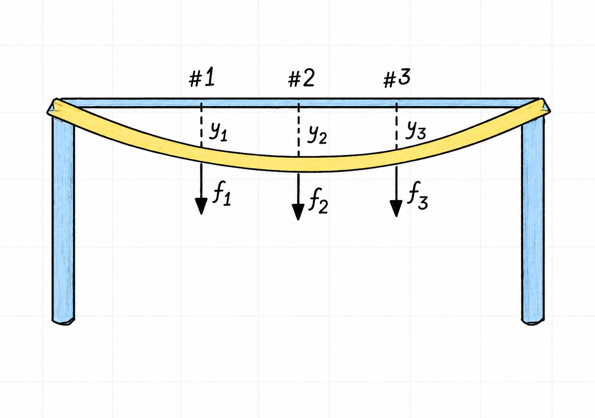

An inverse matrix reverses the transformation performed by a matrix. This is
the matrix analogue of multiplying a nonzero scalar by its reciprocal. For
example, the inverse of $3$ is $\frac{1}{3}$, since multiplying in either
order returns $1$.

An $n\times n$ matrix $A$ is **invertible** if there is an $n\times n$ matrix
$C$ such that

$$
CA=I_n
\qquad\text{and}\qquad
AC=I_n
$$

Here, $I_n$ is the $n\times n$ identity matrix. If such a matrix $C$ exists,
it is unique and is denoted by $A^{-1}$. Therefore

$$
A^{-1}A=I_n
\qquad\text{and}\qquad
AA^{-1}=I_n
$$

To see why the inverse is unique, suppose that $B$ and $C$ are both inverses
of $A$. Then

$$
\begin{aligned}
B
&= BI_n \\
&= B(AC) \\
&= (BA)C \\
&= I_nC \\
&= C.
\end{aligned}
$$

There is no general operation of matrix division. Matrix multiplication is not
commutative, so the order in which an inverse is applied matters. A two-sided
inverse also requires $A$ to be square.

A matrix that is not invertible is called **singular**. An invertible matrix
is also called **nonsingular**

## Verifying an inverse

Consider the matrices

$$
A=
\begin{bmatrix}
2 & 5 \\
-3 & -7
\end{bmatrix}
\qquad
C=
\begin{bmatrix}
-7 & -5 \\
3 & 2
\end{bmatrix}
$$

To verify that $C$ is the inverse of $A$, both multiplication orders must give
the identity matrix

$$
\begin{aligned}
AC
&=
\begin{bmatrix}
2 & 5 \\
-3 & -7
\end{bmatrix}
\begin{bmatrix}
-7 & -5 \\
3 & 2
\end{bmatrix}
\\[0.5em]
&=
\begin{bmatrix}
-14+15 & -10+10 \\
21-21 & 15-14
\end{bmatrix}
=
\begin{bmatrix}
1 & 0 \\
0 & 1
\end{bmatrix}
=I_2
\end{aligned}
$$

Similarly

$$
\begin{aligned}
CA
&=
\begin{bmatrix}
-7 & -5 \\
3 & 2
\end{bmatrix}
\begin{bmatrix}
2 & 5 \\
-3 & -7
\end{bmatrix}
\\[0.5em]
&=
\begin{bmatrix}
-14+15 & -35+35 \\
6-6 & 15-14
\end{bmatrix}
=
\begin{bmatrix}
1 & 0 \\
0 & 1
\end{bmatrix}
=I_2
\end{aligned}
$$

Since $AC=CA=I_2$, it follows that

$$
C=A^{-1}
$$

## Inverse of a two-by-two matrix

::: {#nte-inverse-two-by-two .callout-note title="Theorem 2.2.4 — Inverse of a Two-by-Two Matrix"}

**Textbook reference:** p.135

For a matrix

$$
A=
\begin{bmatrix}
a & b \\
c & d
\end{bmatrix}
$$

the determinant is

$$
\det(A)=ad-bc
$$

If $ad-bc\neq 0$, then $A$ is invertible and

$$
A^{-1}
=
\frac{1}{ad-bc}
\begin{bmatrix}
d & -b \\
-c & a
\end{bmatrix}
$$

If $ad-bc=0$, division by the determinant is impossible and $A$ is singular.

:::

The determinant therefore acts as a quick test for invertibility in the
two-by-two case. A zero determinant means that the transformation collapses
the plane into a lower-dimensional set, so no transformation can undo it.

<!-- pagebreak -->

## Solving a linear system with an inverse

::: {#nte-solving-with-an-inverse .callout-note title="Theorem 2.2.5 — Solving a System with an Inverse"}

**Textbook reference:** p.136

If $A$ is an invertible $n\times n$ matrix, then for every
$\vec{b}\in\mathbb{R}^n$, the equation

$$
A\vec{x}=\vec{b}
$$

has the unique solution

$$
\vec{x}=A^{-1}\vec{b}.
$$

:::

Multiplying both sides on the left by $A^{-1}$ gives

$$
\begin{aligned}
A^{-1}A\vec{x} &= A^{-1}\vec{b} \\
I_n\vec{x} &= A^{-1}\vec{b} \\
\vec{x} &= A^{-1}\vec{b}
\end{aligned}
$$

Consider the system

$$
\begin{aligned}
3x_1+4x_2 &= 3 \\
5x_1+6x_2 &= 7
\end{aligned}
$$

Its matrix form is

$$
A\vec{x}=\vec{b}
\qquad\text{with}\qquad
A=
\begin{bmatrix}
3 & 4 \\
5 & 6
\end{bmatrix}
\qquad
\vec{b}=
\begin{bmatrix}
3 \\
7
\end{bmatrix}
$$

Using the two-by-two inverse formula

$$
\begin{aligned}
A^{-1}
&=
\frac{1}{3\cdot 6-4\cdot 5}
\begin{bmatrix}
6 & -4 \\
-5 & 3
\end{bmatrix}
\\[0.5em]
&=
\begin{bmatrix}
-3 & 2 \\
\frac{5}{2} & -\frac{3}{2}
\end{bmatrix}
\end{aligned}
$$

The solution is therefore

$$
\begin{aligned}
\vec{x}
&=A^{-1}\vec{b} \\
&=
\begin{bmatrix}
-3 & 2 \\
\frac{5}{2} & -\frac{3}{2}
\end{bmatrix}
\begin{bmatrix}
3 \\
7
\end{bmatrix}
\\[0.5em]
&=
\begin{bmatrix}
-9+14 \\
\frac{15}{2}-\frac{21}{2}
\end{bmatrix}
=
\begin{bmatrix}
5 \\
-3
\end{bmatrix}
\end{aligned}
$$

<!-- pagebreak -->

## Engineering interpretation: flexibility and stiffness

Inverse matrices appear naturally in structural models. Consider a horizontal
elastic beam supported at both ends, with forces applied at three points.
@fig-elastic-beam-deflection shows the force and deflection coordinates used
in this model. Let

{#fig-elastic-beam-deflection width=85% fig-pos="H" fig-align="center"}

$$
\vec{f}=
\begin{bmatrix}
f_1 \\
f_2 \\
f_3
\end{bmatrix}
\qquad\text{and}\qquad
\vec{y}=
\begin{bmatrix}
y_1 \\
y_2 \\
y_3
\end{bmatrix}
$$

list the applied forces and the corresponding vertical deflections. In a
linear elastic model, a **flexibility matrix** $D$ relates them by

$$
\vec{y}=D\vec{f}.
$$

Each column of $D$ describes the deflections caused by a unit force at one
point while the other applied forces are zero. If $D$ is invertible, its
inverse is the **stiffness matrix**

$$
\vec{f}=D^{-1}\vec{y}.
$$

The columns of $D^{-1}$ have the complementary interpretation: the $i$th
column gives the forces required to produce a unit deflection at point $i$ and
zero deflection at the other measured points. The units also reflect the
physical meaning: flexibility may be measured in deflection per unit force,
whereas stiffness is measured in force per unit deflection.

This is a useful engineering view of an inverse. The same model can answer two
different questions: “what deflection results from these loads?” and “what
loads are needed to obtain this deflection?”

## Finding an inverse by row reduction

For larger matrices, an inverse can be found by augmenting $A$ with the
identity matrix

$$
\left[A\mid I_n\right]
$$

Apply row operations until the left side becomes the identity. If this is not
possible, $A$ is singular and has no inverse. If it is possible, the right side
becomes the inverse

$$
\left[A\mid I_n\right]
\longrightarrow
\left[I_n\mid A^{-1}\right]
$$

This works because row operations amount to multiplying by invertible
elementary matrices. If their combined effect changes $A$ into $I_n$, that
same combination is $A^{-1}$

Consider

$$
A=
\begin{bmatrix}
1 & 2 & 0 \\
0 & 1 & 1 \\
1 & 2 & 1
\end{bmatrix}
$$

Begin with the augmented matrix

$$
\left[
\begin{array}{ccc|ccc}
1 & 2 & 0 & 1 & 0 & 0 \\
0 & 1 & 1 & 0 & 1 & 0 \\
1 & 2 & 1 & 0 & 0 & 1
\end{array}
\right]
$$

Eliminate the leading entry in the third row with
$R_3\leftarrow R_3-R_1$

$$
\left[
\begin{array}{ccc|ccc}
1 & 2 & 0 & 1 & 0 & 0 \\
0 & 1 & 1 & 0 & 1 & 0 \\
0 & 0 & 1 & -1 & 0 & 1
\end{array}
\right]
$$

Next use $R_2\leftarrow R_2-R_3$

$$
\left[
\begin{array}{ccc|ccc}
1 & 2 & 0 & 1 & 0 & 0 \\
0 & 1 & 0 & 1 & 1 & -1 \\
0 & 0 & 1 & -1 & 0 & 1
\end{array}
\right]
$$

Finally use $R_1\leftarrow R_1-2R_2$

$$
\left[
\begin{array}{ccc|ccc}
1 & 0 & 0 & -1 & -2 & 2 \\
0 & 1 & 0 & 1 & 1 & -1 \\
0 & 0 & 1 & -1 & 0 & 1
\end{array}
\right]
=
\left[I_3\mid A^{-1}\right]
$$

Therefore

$$
A^{-1}
=
\begin{bmatrix}
-1 & -2 & 2 \\
1 & 1 & -1 \\
-1 & 0 & 1
\end{bmatrix}
$$

As a check

$$
\begin{aligned}
A^{-1}A
&=
\begin{bmatrix}
-1 & -2 & 2 \\
1 & 1 & -1 \\
-1 & 0 & 1
\end{bmatrix}
\begin{bmatrix}
1 & 2 & 0 \\
0 & 1 & 1 \\
1 & 2 & 1
\end{bmatrix}
\\[0.5em]
&=
\begin{bmatrix}
1 & 0 & 0 \\
0 & 1 & 0 \\
0 & 0 & 1
\end{bmatrix}
=I_3
\end{aligned}
$$

## Properties of inverse matrices

The inverse operation undoes a transformation. Applying it twice must therefore
recover the original transformation. In addition, a product of invertible
matrices is invertible, but the order of its inverse is reversed.

::: {#nte-inverse-properties .callout-note title="Theorem 2.2.6 — Properties of Inverse Matrices"}

**Textbook reference:** p.137

For invertible $n\times n$ matrices $A$ and $B$,

$$
\begin{aligned}
\left(A^{-1}\right)^{-1} &= A, \\
(AB)^{-1} &= B^{-1}A^{-1}, \\
\left(A^T\right)^{-1} &= \left(A^{-1}\right)^T.
\end{aligned}
$$

:::

The first identity follows directly from the definition: $A$ is a two-sided
inverse of $A^{-1}$ because

$$
A^{-1}A=I_n
\qquad\text{and}\qquad
AA^{-1}=I_n.
$$

For the product identity, verify that $B^{-1}A^{-1}$ is a two-sided inverse of
$AB$:

$$
\begin{aligned}
(AB)\left(B^{-1}A^{-1}\right)
&= A\left(BB^{-1}\right)A^{-1} \\
&= AI_nA^{-1} \\
&= I_n
\end{aligned}
\qquad\text{and}\qquad
\begin{aligned}
\left(B^{-1}A^{-1}\right)(AB)
&= B^{-1}\left(A^{-1}A\right)B \\
&= B^{-1}I_nB \\
&= I_n.
\end{aligned}
$$

The reversed order is essential: $A^{-1}B^{-1}$ does not generally undo the
transformation $AB$. Finally, transposing the two identities for $A^{-1}$
gives

$$
\begin{aligned}
A^T\left(A^{-1}\right)^T
&= \left(A^{-1}A\right)^T \\
&= I_n,
\end{aligned}
$$

and similarly $\left(A^{-1}\right)^TA^T=I_n$. Thus
$\left(A^{-1}\right)^T$ is the inverse of $A^T$.

## Elementary matrices

An **elementary matrix** is obtained by applying one elementary row operation
to an identity matrix. Multiplying a matrix on the left by an elementary
matrix performs that same row operation on the matrix.

For example, let

$$
A=
\begin{bmatrix}
a & b & c \\
d & e & f \\
g & h & i
\end{bmatrix}
$$

and define

$$
E_1=
\begin{bmatrix}
1 & 0 & 0 \\
0 & 1 & 0 \\
-4 & 0 & 1
\end{bmatrix}
\qquad
E_2=
\begin{bmatrix}
0 & 1 & 0 \\
1 & 0 & 0 \\
0 & 0 & 1
\end{bmatrix}
\qquad
E_3=
\begin{bmatrix}
1 & 0 & 0 \\
0 & 1 & 0 \\
0 & 0 & 5
\end{bmatrix}.
$$

Their products with $A$ make the three types of elementary row operation
visible:

$$
\begin{aligned}
E_1A
&=
\begin{bmatrix}
a & b & c \\
d & e & f \\
g-4a & h-4b & i-4c
\end{bmatrix}
&&\text{corresponding to } R_3\leftarrow R_3-4R_1, \\
E_2A
&=
\begin{bmatrix}
d & e & f \\
a & b & c \\
g & h & i
\end{bmatrix}
&&\text{corresponding to } R_1\leftrightarrow R_2, \\
E_3A
&=
\begin{bmatrix}
a & b & c \\
d & e & f \\
5g & 5h & 5i
\end{bmatrix}
&&\text{corresponding to } R_3\leftarrow 5R_3.
\end{aligned}
$$

Several row operations can be combined by multiplying their elementary
matrices. For instance, $E_2E_1A$ first performs
$R_3\leftarrow R_3-4R_1$ and then swaps rows one and two. This is the basis
for the row-reduction method above: if elementary matrices reduce $A$ to the
identity, their product is $A^{-1}$. See
[Elimination Matrices](2-2-elementary-matrices.md) for a complete inverse
calculation using this approach.

## Invertibility and row equivalence

Elementary matrices are themselves invertible. To invert an elementary matrix,
reverse the row operation used to create it. For the matrix $E_1$ above, the
operation is $R_3\leftarrow R_3-4R_1$. Its reverse is
$R_3\leftarrow R_3+4R_1$, so

$$
E_1^{-1}=
\begin{bmatrix}
1 & 0 & 0 \\
0 & 1 & 0 \\
4 & 0 & 1
\end{bmatrix}.
$$

Indeed, applying the reverse operation to $E_1$ returns the identity matrix.
Equivalently, $E_1^{-1}E_1=E_1E_1^{-1}=I_3$.

::: {#nte-row-equivalence-invertibility .callout-note title="Theorem 2.2.7 — Row-Equivalence Criterion for Invertibility"}

**Textbook reference:** p.140

An $n\times n$ matrix $A$ is invertible if and only if it is **row equivalent**
to $I_n$. Moreover, any sequence of elementary row operations that reduces
$A$ to $I_n$ transforms $I_n$ into $A^{-1}$.

:::

To see why, suppose the row operations correspond to elementary matrices
$E_1,E_2,\ldots,E_k$. If they reduce $A$ to the identity, then

$$
E_k\cdots E_2E_1A=I_n.
$$

Therefore the product of elementary matrices is $A^{-1}$. Applying the same
operations to the identity gives

$$
E_k\cdots E_2E_1I_n=A^{-1}.
$$

This result gives a practical test and algorithm for finding an inverse:

1. Form the augmented matrix $\left[A\mid I_n\right]$.
2. Row reduce its left side.
3. If the result is $\left[I_n\mid A^{-1}\right]$, then $A$ is invertible.
   Otherwise, $A$ is singular and has no inverse.

## Worked example: finding a three-by-three inverse

Find the inverse of

$$
A=
\begin{bmatrix}
0 & 1 & 2 \\
1 & 0 & 3 \\
4 & -3 & 8
\end{bmatrix}.
$$

Augment $A$ with $I_3$ and apply row operations to both sides:

$$
\left[
\begin{array}{ccc|ccc}
0 & 1 & 2 & 1 & 0 & 0 \\
1 & 0 & 3 & 0 & 1 & 0 \\
4 & -3 & 8 & 0 & 0 & 1
\end{array}
\right].
$$

First swap the first two rows, eliminate below the first pivot, and then
eliminate below the second pivot:

$$
\begin{aligned}
R_1&\leftrightarrow R_2, \\
R_3&\leftarrow R_3-4R_1, \\
R_3&\leftarrow R_3+3R_2,
\end{aligned}
\qquad
\left[
\begin{array}{ccc|ccc}
1 & 0 & 3 & 0 & 1 & 0 \\
0 & 1 & 2 & 1 & 0 & 0 \\
0 & 0 & 2 & 3 & -4 & 1
\end{array}
\right].
$$

Scale the third pivot and clear the entries above it:

$$
\begin{aligned}
R_3&\leftarrow \frac{1}{2}R_3, \\
R_1&\leftarrow R_1-3R_3, \\
R_2&\leftarrow R_2-2R_3.
\end{aligned}
$$

This gives

$$
\left[
\begin{array}{ccc|ccc}
1 & 0 & 0 & -\frac{9}{2} & 7 & -\frac{3}{2} \\
0 & 1 & 0 & -2 & 4 & -1 \\
0 & 0 & 1 & \frac{3}{2} & -2 & \frac{1}{2}
\end{array}
\right]
=
\left[I_3\mid A^{-1}\right].
$$

Therefore

$$
A^{-1}=
\begin{bmatrix}
-\frac{9}{2} & 7 & -\frac{3}{2} \\
-2 & 4 & -1 \\
\frac{3}{2} & -2 & \frac{1}{2}
\end{bmatrix}.
$$

Because the left side reduces to $I_3$, $A$ is invertible. As a check,

$$
A A^{-1}=I_3.
$$
