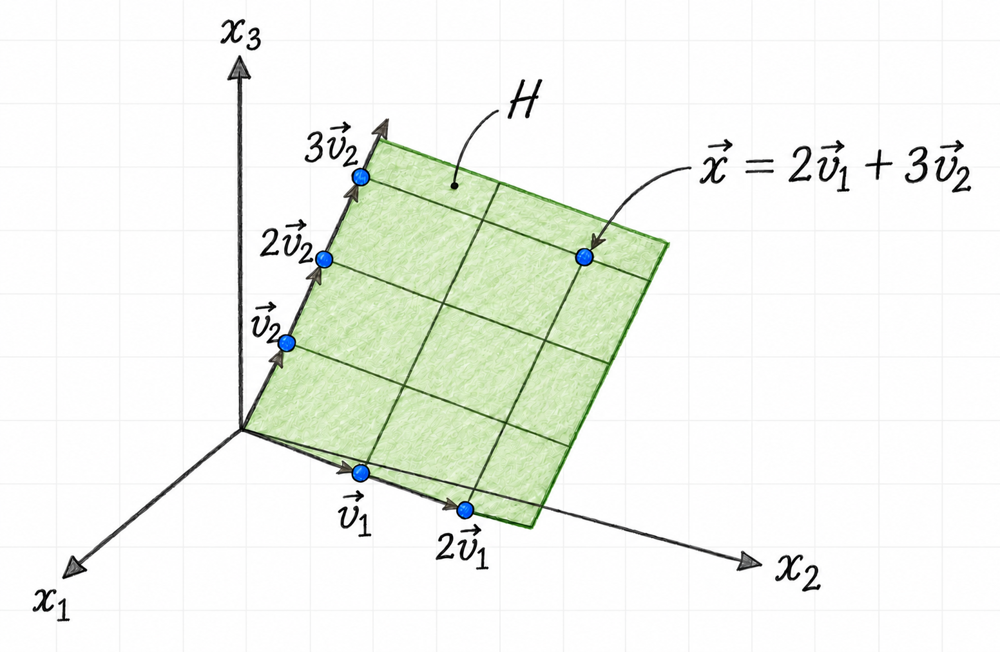

Dimension measures how many independent directions a vector space contains.
For a matrix, the corresponding idea is its rank: the number of independent
columns, or equivalently the dimension of its column space. Together with the
nullity, rank accounts for every input direction of a matrix transformation.

For definitions and step-by-step basis calculations, see
[Subspaces of $\mathbb{R}^n$](2-8-subspaces-of-Rn.md).

## Dimension of a vector space

The **dimension** of a nonzero vector space $V$ is the number of vectors in
any basis for $V$:

$$
\dim(V)=\text{number of vectors in a basis for }V
$$

A basis cannot contain the zero vector, since a set containing the zero vector
is linearly dependent. The zero subspace is the one exception to the usual
description: by definition,

$$
\dim(\{\vec{0}\})=0
$$

Although a vector space can have many different bases, every basis has the
same number of vectors. This makes dimension a property of the space rather
than of a particular basis.

## Rank and nullity

The **column space** of a matrix $A$ is denoted by $\operatorname{Col}(A)$.
The **rank** of $A$ is the dimension of that space:

$$
\operatorname{rank}(A)=\dim\bigl(\operatorname{Col}(A)\bigr)
$$

For example, row reduction of

$$
A=
\begin{bmatrix}
3 & 1 & 1 & 6 \\
1 & -2 & 5 & -5 \\
4 & 1 & 2 & 7
\end{bmatrix}
$$

gives

$$
\operatorname{rref}(A)=
\begin{bmatrix}
1 & 0 & 1 & 1 \\
0 & 1 & -2 & 3 \\
0 & 0 & 0 & 0
\end{bmatrix}
$$

The pivot columns are columns $1$ and $2$. Therefore, the corresponding
columns of the original matrix form a basis for the column space:

$$
\left\{
\begin{bmatrix}3\\1\\4\end{bmatrix},
\begin{bmatrix}1\\-2\\1\end{bmatrix}
\right\}
$$

Hence,

$$
\operatorname{rank}(A)=2
$$

Columns $3$ and $4$ are free-variable columns in the reduced matrix. Solving
$A\vec{x}=\vec{0}$ gives

$$
\begin{aligned}
x_1&=-x_3-x_4, \\
x_2&=2x_3-3x_4.
\end{aligned}
$$

Thus,

$$
\vec{x}
=x_3
\begin{bmatrix}
-1\\2\\1\\0
\end{bmatrix}
+x_4
\begin{bmatrix}
-1\\-3\\0\\1
\end{bmatrix},
$$

so the null space has a basis with two vectors and

$$
\dim\bigl(\operatorname{Nul}(A)\bigr)=2.
$$

The dimension of the null space is also called the **nullity** of $A$.

::: {.callout-note title="Rank Theorem"}

If a matrix $A$ has $n$ columns, then

$$
\operatorname{rank}(A)+\dim\bigl(\operatorname{Nul}(A)\bigr)=n.
$$

:::

In the example, $2+2=4$, the number of columns of $A$. The theorem expresses a
useful balance: every input direction is either represented by a pivot
direction or contributes a free direction in the null space.

## Coordinates relative to a basis

Let

$$
\vec{v}_1=
\begin{bmatrix}
3\\6\\2
\end{bmatrix},
\qquad
\vec{v}_2=
\begin{bmatrix}
-1\\0\\1
\end{bmatrix},
\qquad
\vec{x}=
\begin{bmatrix}
3\\12\\7
\end{bmatrix},
$$

and let $H=\operatorname{span}\{\vec{v}_1,\vec{v}_2\}$. Since
$\vec{v}_1$ and $\vec{v}_2$ are linearly independent,

$$
B=\{\vec{v}_1,\vec{v}_2\}
$$

is a basis for $H$. To determine whether $\vec{x}$ lies in $H$, solve

$$
c_1\vec{v}_1+c_2\vec{v}_2=\vec{x}.
$$

The augmented matrix reduces as follows:

$$
\left[
\begin{array}{cc|c}
3 & -1 & 3 \\
6 & 0 & 12 \\
2 & 1 & 7
\end{array}
\right]
\sim
\left[
\begin{array}{cc|c}
1 & 0 & 2 \\
0 & 1 & 3 \\
0 & 0 & 0
\end{array}
\right].
$$

Thus $c_1=2$ and $c_2=3$, so

$$
\vec{x}=2\vec{v}_1+3\vec{v}_2.
$$

Therefore $\vec{x}\in H$, and its coordinate vector relative to $B$ is

$$
[\vec{x}]_B=
\begin{bmatrix}
2\\3
\end{bmatrix}.
$$

@fig-dimension-and-rank-basis-coordinates illustrates these coordinates:
starting at the origin, two steps in the $\vec{v}_1$ direction and three in
the $\vec{v}_2$ direction reach $\vec{x}$. Although $H$ lies in
$\mathbb{R}^3$, only two basis coordinates are needed to describe a vector
in $H$, so $\dim(H)=2$.

{#fig-dimension-and-rank-basis-coordinates width=85% fig-pos="H" fig-align="center"}

The basis defines a coordinate system on $H$. Its basis vectors form the
columns of the matrix

$$
P_B=
\begin{bmatrix}
3 & -1 \\
6 & 0 \\
2 & 1
\end{bmatrix},
$$

which maps a coordinate vector to its usual coordinates in $\mathbb{R}^3$:

$$
P_B[\vec{x}]_B
=
\begin{bmatrix}
3 & -1 \\
6 & 0 \\
2 & 1
\end{bmatrix}
\begin{bmatrix}
2\\3
\end{bmatrix}
=
\begin{bmatrix}
3\\12\\7
\end{bmatrix}
=\vec{x}.
$$

## Finding rank from pivot columns

Row reduction makes the rank easy to identify. Consider

$$
A=
\begin{bmatrix}
2 & 5 & -3 & -4 & 8 \\
4 & 7 & -4 & -3 & 9 \\
6 & 9 & -5 & 2 & 4 \\
0 & -9 & 6 & 5 & -6
\end{bmatrix}.
$$

An echelon form is

$$
\begin{bmatrix}
2 & 5 & -3 & -4 & 8 \\
0 & -3 & 2 & 5 & -7 \\
0 & 0 & 0 & 4 & -6 \\
0 & 0 & 0 & 0 & 0
\end{bmatrix}.
$$

There are pivots in columns $1$, $2$, and $4$. Consequently, columns $1$,
$2$, and $4$ of the original matrix form a basis for $\operatorname{Col}(A)$,
and

$$
\operatorname{rank}(A)=3.
$$

## The Basis Theorem

::: {.callout-note title="Basis Theorem"}

Let $H$ be a $p$-dimensional subspace of $\mathbb{R}^n$.

- Any linearly independent set of exactly $p$ vectors in $H$ is a basis for
  $H$.
- Any set of exactly $p$ vectors that spans $H$ is a basis for $H$.

:::

Once the number of vectors reaches the dimension of a space, it is enough to
verify either linear independence or spanning; the other property follows
automatically.

## Invertibility and rank

The rank theorem is one part of the larger **Invertible Matrix Theorem**. Let
$A$ be an $n\times n$ matrix. The following statements are equivalent: for a
given $A$, either all are true or all are false.

a. $A$ is invertible.
b. $A$ is row equivalent to the $n\times n$ identity matrix.
c. $A$ has $n$ pivot positions.
d. The equation $A\vec{x}=\vec{0}$ has only the trivial solution.
e. The columns of $A$ form a linearly independent set.
f. The linear transformation $\vec{x}\mapsto A\vec{x}$ is one-to-one.
g. For every $\vec{b}\in\mathbb{R}^n$, the equation
   $A\vec{x}=\vec{b}$ has at least one solution.
h. The columns of $A$ span $\mathbb{R}^n$.
i. The linear transformation $\vec{x}\mapsto A\vec{x}$ maps
   $\mathbb{R}^n$ onto $\mathbb{R}^n$.
j. There is an $n\times n$ matrix $C$ such that $CA=I$.
k. There is an $n\times n$ matrix $D$ such that $AD=I$.
l. $A^T$ is invertible.
m. The columns of $A$ form a basis for $\mathbb{R}^n$.
n. $\operatorname{Col}(A)=\mathbb{R}^n$.
o. $\operatorname{rank}(A)=n$.
p. $\dim\bigl(\operatorname{Nul}(A)\bigr)=0$.
q. $\operatorname{Nul}(A)=\{\vec{0}\}$.

For a square matrix, full rank therefore means that the matrix has no lost
input directions and reaches every vector in its codomain.
