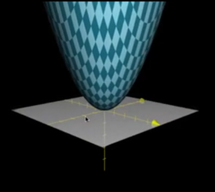
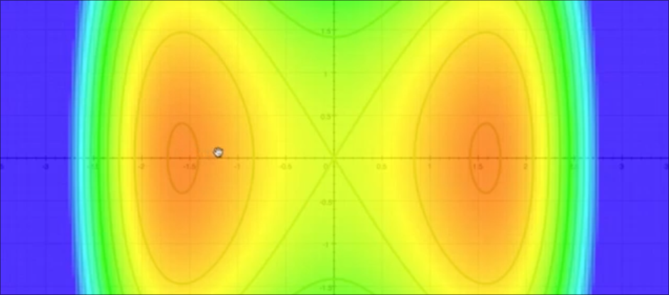
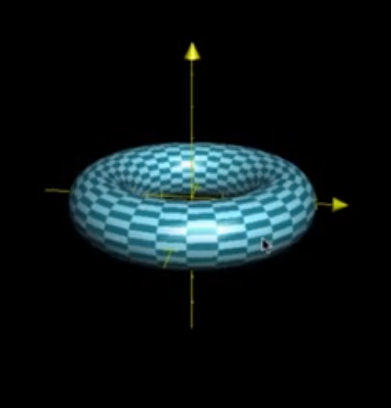
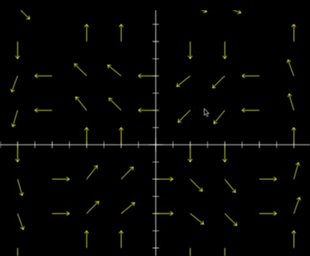
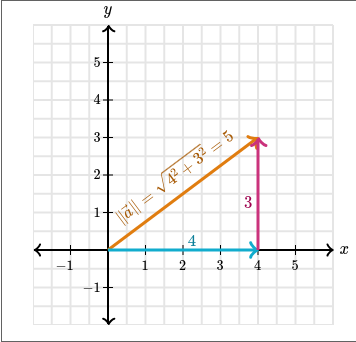
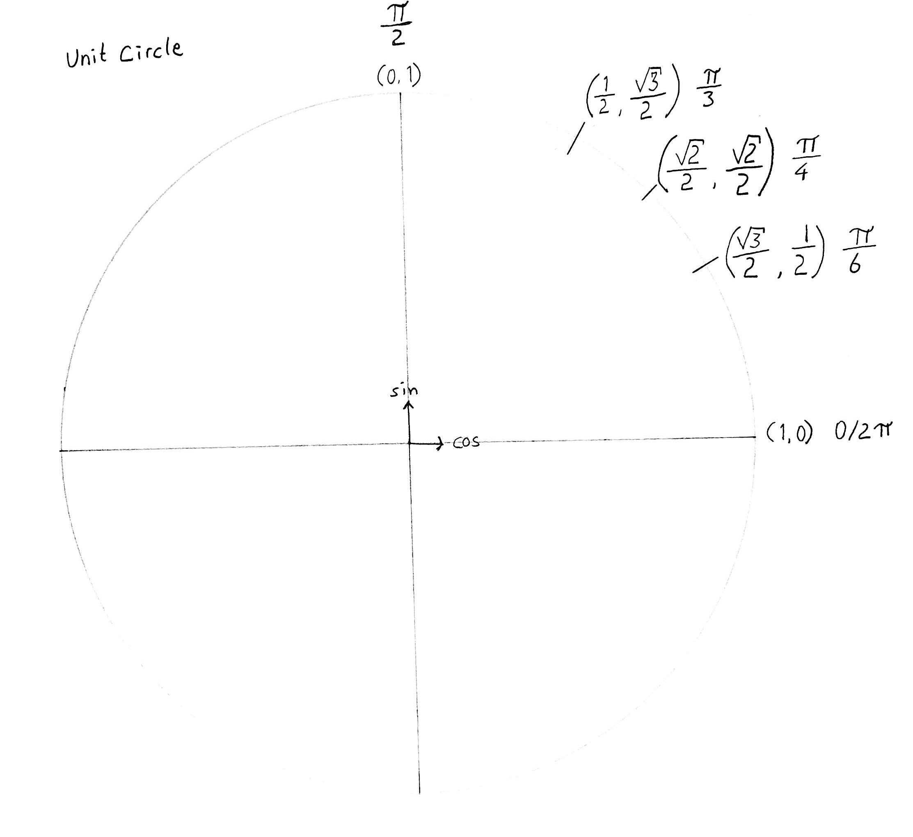

# Multivariable functions
Source: [Khan Academy — Multivariable functions](https://www.khanacademy.org/math/multivariable-calculus/thinking-about-multivariable-function/introduction-to-multivariable-calculus/v/multivariable-functions)

A single-variable function takes one input, such as $f(x)$. A
multivariable function takes two or more inputs, such as $f(x,y)$.

A multivariable function can also be vector-valued. For example,

$$
\mathbf{F}(x,y)
=
\begin{bmatrix}
ax \\
by
\end{bmatrix},
\qquad
\mathbf{F}:\mathbb{R}^2\rightarrow\mathbb{R}^2.
$$

The domain and codomain describe the dimensions involved. A function may take points from $\mathbb{R}^2$ as input and return either a scalar, a vector in $\mathbb{R}^2$, or a vector in $\mathbb{R}^3$.

The following sections introduce several ways to represent multivariable functions.

## Graphs
{height=77mm}

The graph of a scalar-valued function

$$
f:\mathbb{R}^2\rightarrow\mathbb{R}
$$

is a surface in $\mathbb{R}^3$ Each input point $(x,y)$ lies in the $xy$-plane, and its output $z=f(x,y)$ determines the height of the surface.

\newpage

## $\mathbb{R}^2$ Color plots
{height=77mm}

A scalar-valued function can also be represented as a color plot. Each  point $(x,y)$ in the domain is assigned a color according to the value $f(x,y)$. Temperature, pressure, and wind-speed fields can be visualized this way.

## Surfaces in $\mathbb{R}^3$, parametric surfaces
{height=77mm}

A parametric surface is described by a vector-valued function

$$
\mathbf{r}(u,v):\mathbb{R}^2\rightarrow\mathbb{R}^3
$$

Each parameter pair $(u,v)$ determines a point on the surface. Surface
integrals can later be used to calculate quantities such as area or flux.

## Vector fields
{height=77mm}

A vector field associates a vector with every point in its domain. For
example, a two-dimensional vector field can be written as

$$
\mathbf{F}:\mathbb{R}^2\rightarrow\mathbb{R}^2
$$

At each point $(x,y)$, the vector $\mathbf{F}(x,y)$ has both a direction
and a magnitude. Vector fields can represent fluid velocity,
gravitational fields, and electric or magnetic fields.

A good way to think about multivariable functions, is to take the input space, for instance $\mathbb{R}^2$, and watch them move to their output. If you get the hang of this, you will find it connects nice to linear algebra.

# Vectors
Vectors can be thought of as lines in two or more dimensions, having both direction and magnitude (length).

## Notation
Vectors can be written in several ways

$$
\vec{v} \
= (1, 2, 3) \
= \begin{bmatrix} 1 \\ 2 \\ 3 \end{bmatrix}
= 1 \blueD{\hat{i}} + 2 \maroonD{\hat{j}} + 3 \greenD{\hat{k}}
$$

We denote them with a little arrow on top of the letter, $\vec{v}$, this convention is used to indicate vectors.

The first notation, $(1, 2, 3)$, is technically referring to a point, but we use it interchangably to indicate vectors. They are usually drawn from origo, but this is not a rule!

The second notation, $\begin{bmatrix} 1 \\ 2 \\ 3 \end{bmatrix}$, is the matrix notation, and can be extended to as many dimensions as needed $$\begin{bmatrix} 1 \\ 2 \\... \\ n-1 \\ n \end{bmatrix}$$

This notation will be discussed in the coming articles.

The third notation, unlike the previous ones, only works in 2D and 3D. The symbol $\blueD{\hat{\imath}}$ (pronounced "i hat") is the unit ‍$x$ vector, so

$$
\blueD{\hat{i}} = (1, 0, 0)
$$

Similarly,

$$
‍\maroonD{\hat{j}} = (0, 1, 0)
$$

and

$$
\greenD{\hat{k}} = (0, 0, 1)
$$

This notation might make more sense once we cover vector addition.

## Addition
Vectors can be added, and subtracted, and in general we apply arithmetic to their corresponding components:

$$
(a, b, c) + (A, B, C) = (a+A, b+B, c+C)
$$

This works for any number of dimension, as long as the vectors added (or subtracted) have the same number of dimensions. Visually, $\greenD{\vec{a}} + \redD{\vec{b}}$ can be seen sliding the tail of $\redD{\vec{b}}$ to the tip of $\greenD{\vec{a}}$, here's an example in $\mathbb{R}^2$

## Scalar multiplication
Scalar is just a fancy word for number, so by multiplying a vector with a scalar we are just changing its magnitude (length). Scalar multiplication are done by multiplying the scalar with each of the vectors components. Scalars can also be negative.

$$
\vec{b} = (1, 2, 3)
\newline
\vec{2b} = (2, 4, 6)
$$

In general

$$
n\vec{b} = n(a, b, c) = (na, nb, nc)
$$

## Magnitude
The magnitude, or length, of a vector is denoted by double or single vertical bars on each side of the vector name, like when we take the absolute value in maths $‍\| \vec{a} \|$ or $| \vec{a} |$.

Thinking of the magnitude as the hypotenuse of a triangle, we calculate it using the Pythagorean theorem. So the magnitude of $ (a, b) $ is $\sqrt{a^2 + b^2}$.

Visually it can be represented like:

# Dot products

{width=195mm}
masterkey
